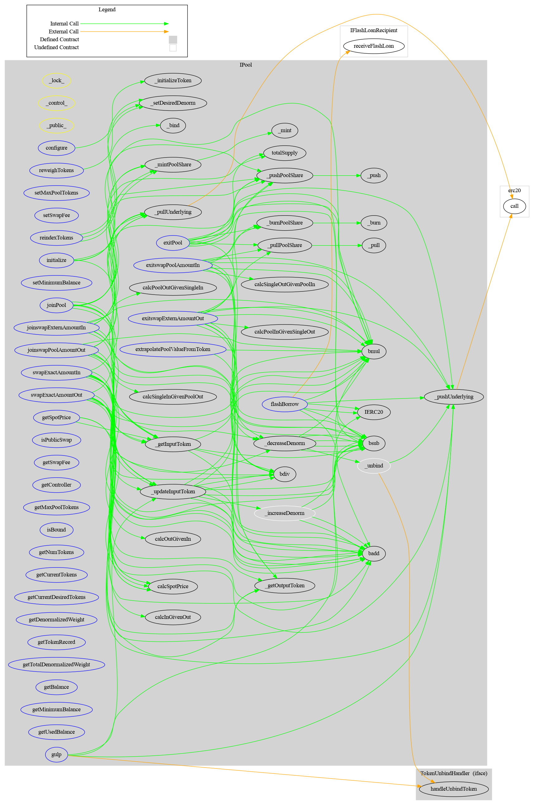
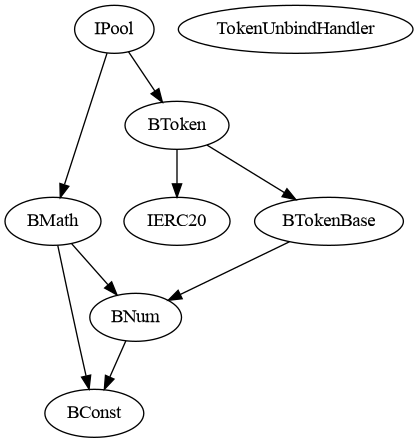
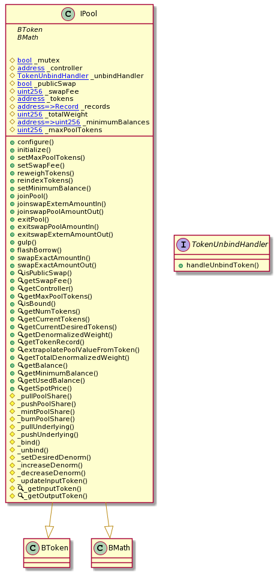
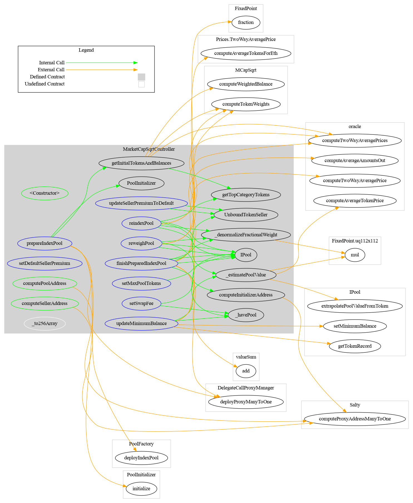
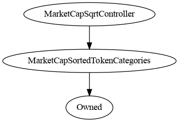
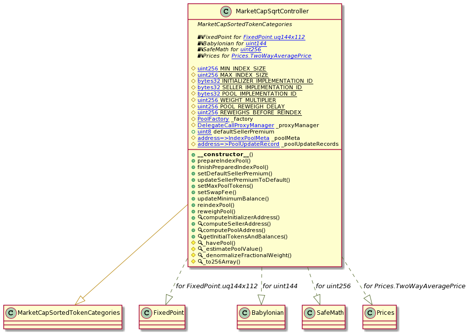
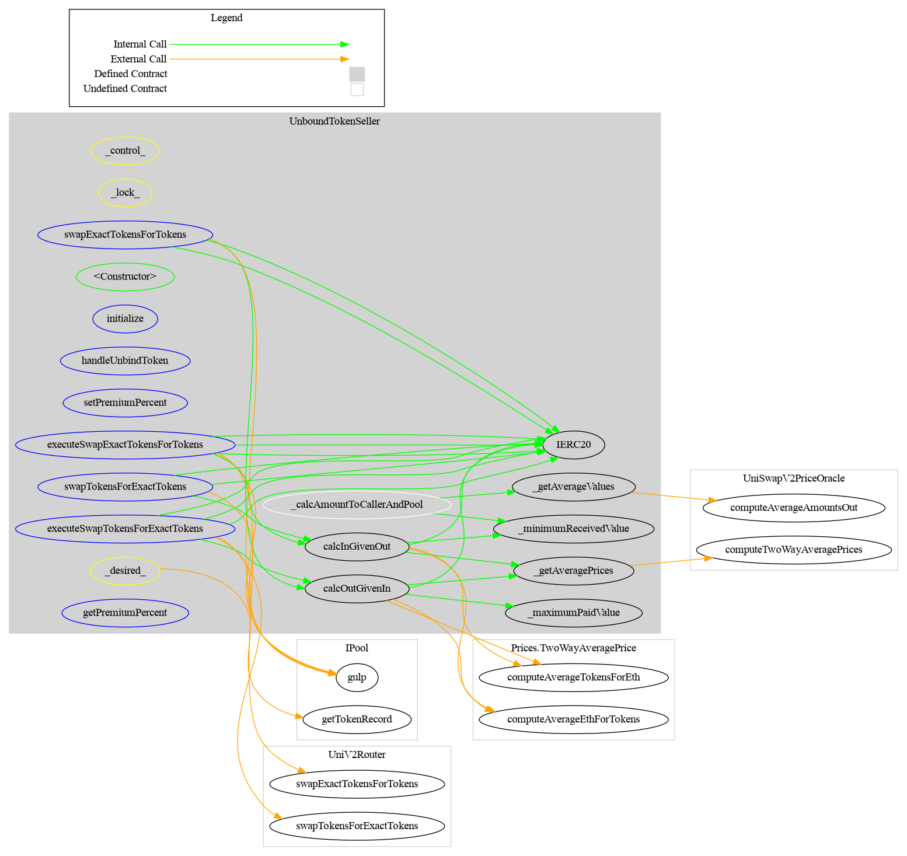
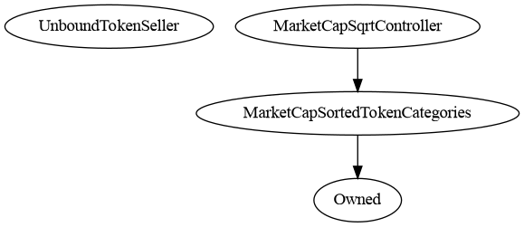
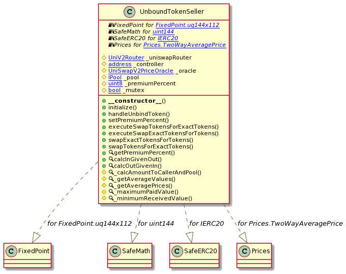

# Indexed Core

## Table of contents

- [Details](#details)
- [Executive summary](#executive-summary)
  - [Week 1](#week-1)
  - [Week 2](#week-2)
- [Scope](#scope)
- [Recommendations](#recommendations)
  - [Increase the number of tests](#increase-the-number-of-tests)
  - [Set up Continuous Integration](#set-up-continuous-integration)
  - [Update documentation](#update-documentation)
  - [Consider using EIP-173 for ownership](#consider-using-eip-173-for-ownership)
  - [Contract size](#contract-size)
- [Issues](#issues)
- [Artifacts](#artifacts)
  - [Sūrya](#sūrya)
  - [Coverage](#coverage)
  - [Tests](#tests)
- [License](#license)

## Details

- **Client** Indexed Finance
- **Date** 2020 October
- **Lead reviewer** Daniel Luca (@cleanunicorn)
- **Repository**: [indexed-core](https://github.com/indexed-finance/indexed-core/)
- **Commit hash** `37506434cc6d223746f01104f65039886dc9b704`
- **Technologies**
  - Solidity
  - Node.JS

## Executive summary

This report represents the results of the engagement with **Indexed Finance** to review **Indexed Core**.

The review was conducted over the course of **2 weeks** from **October 5 to October 16, 2020**. A total of **10 person-days** were spent reviewing the code.

### Week 1

During the first week, we got familiar with the code and the setup of the repository. The client's initial documents were rewritten and moved from inside the repository to a specific URL (https://docs.indexed.finance/indexed-finance-docs/).

We were advised to review the Balancer whitepaper during the first meeting with the client on Monday before starting the code base review. This was important because [some of the code](./code/contracts/balancer/) was forked from the [balancer-core](https://github.com/balancer-labs/balancer-core/) at commit hash `f4ed5d65362a8d6cec21662fb6eae233b0babc1f`. We also discussed the overall idea of the project and how it should be used.

We started reviewing the `MarketCapSqrtController` contract, which revealed some minor issues and some opportunities for optimizing transaction fees. 

We set up another meeting with the client to discuss early findings and suggestions. This allows the client to start thinking and possibly working on initial findings.

We used the rest of the week to focus on the [Balancer contracts](./code/contracts/balancer/). Most of the code is unchanged, except for [IPool](./code/contracts/balancer/IPool.sol), which has major changes compared to the original Balancer code. Most of the code from Because Balancer was already reviewed by [Trail of Bits](https://github.com/balancer-labs/balancer-core/blob/master/Trail%20of%20Bits%20Full%20Audit.pdf); hence that report was also quickly read-through.

### Week 2

The second week was used to go through the rest of the code. The first half of the week was used to focus on `IPool`, which makes up a significant amount of the reviewed code. This is a complex part of the whole system and also the part that users interact with. There is a lot of complexity present because of the large number of features it implements.

The following days were spent reviewing `UnboundTokenSeller`, a part of the system designated to allow users to swap undesired tokens for desired tokens.

The rest of the week was spent reviewing some of the more complicated logic with a clearer understanding of the whole system.

On Friday, we set up a new meeting with the client to present new findings and discuss what parts they consider should be revisited. Based on the discussion, we spent more time reviewing the token reindexing.

## Scope

The initial review focused on the [indexed-core](https://github.com/indexed-finance/indexed-core) identified by the commit hash `37506434cc6d223746f01104f65039886dc9b704`. Even though we discussed changing the commit hash to allow some last minute updates to enter the review, in the end (with the client's approval), we decided not to change the initial commit hash.

We focused on manually reviewing the codebase, searching for security issues such as, but not limited to re-entrancy problems, transaction ordering, block timestamp dependency, exception handling, call stack depth limitation, integer overflow/underflow, self-destructible contracts, unsecured balance, use of origin, gas costly patterns, architectural problems, code readability.

**Includes:**
- All the files in the [balancer](./code/contracts/balancer) folder
- [MarketCapSqrtController](./code/contracts/MarketCapSqrtController.sol)
- [UnboundTokenSeller.sol](./code/contracts/UnboundTokenSeller.sol)

**Excludes:**
- Everything else

## Recommendations 

We identified a few possible general improvements that are not security issues during the review, which will bring value to the developers and the community reviewing and using the product.

### Increase the number of tests

A good rule of thumb is to have 100% test coverage. This does not guarantee the lack of security problems, but it means that the desired functionality behaves as intended. The negative tests also bring a lot of value because not allowing some actions to happen is also part of the desired behavior.

Critical parts of the system do not have enough or complete tests, such as the flash borrow functionality.

Most of the tests should be written following the [Test-driven development (TDD)](https://en.wikipedia.org/wiki/Test-driven_development) process. This methodology (described simplistically) follows the steps: write test, run test suite, write code, pass the test suite. This ensures no code is added to the repository without an associated array of tests to validate the correct operation.

This is taken from the coverage report generated by [buidler](https://buidler.dev/) using [solidity-coverage](https://github.com/sc-forks/solidity-coverage) plugin. The full coverage output is included in [Artifacts - Coverage](#coverage).

File                                 |  % Stmts | % Branch |  % Funcs |  % Lines |Uncovered Lines |
-------------------------------------|----------|----------|----------|----------|----------------|
contracts/                          |    70.26 |    43.59 |    71.57 |    70.49 |                |
MarketCapSortedTokenCategories.sol |    93.44 |    57.14 |    84.62 |    93.33 |  96,97,213,214 |
MarketCapSqrtController.sol        |    51.69 |    28.13 |    68.42 |    51.11 |... 525,526,553 |
Owned.sol                          |    83.33 |       50 |       75 |    85.71 |             20 |
PoolFactory.sol                    |       50 |       50 |    44.44 |       50 |... 175,178,198 |
PoolInitializer.sol                |    69.88 |    34.21 |    66.67 |    71.26 |... 347,349,350 |
UnboundTokenSeller.sol             |    83.72 |    58.82 |    89.47 |    84.27 |... 464,465,466 |
UniSwapV2PriceOracle.sol           |    61.84 |    38.89 |    64.71 |    61.84 |... 373,374,378 |
contracts/balancer/                 |    82.86 |     48.8 |    79.76 |    82.64 |                |
BConst.sol                         |      100 |      100 |      100 |      100 |                |
BMath.sol                          |      100 |      100 |      100 |      100 |                |
BNum.sol                           |    98.28 |    65.63 |      100 |    98.21 |             96 |
BToken.sol                         |    47.62 |       25 |    52.94 |    47.62 |... 187,188,190 |
IPool.sol                          |    81.62 |    47.57 |       82 |     81.4 |... 3,1344,1345 |
contracts/interfaces/               |      100 |      100 |      100 |      100 |                |
IBPool.sol                         |      100 |      100 |      100 |      100 |                |
IFlashLoanRecipient.sol            |      100 |      100 |      100 |      100 |                |
IUniSwap.sol                       |      100 |      100 |      100 |      100 |                |
IUniswapV2Factory.sol              |      100 |      100 |      100 |      100 |                |
IUniswapV2Library.sol              |      100 |      100 |      100 |      100 |                |
IUniswapV2Pair.sol                 |      100 |      100 |      100 |      100 |                |
IUniswapV2Router01.sol             |      100 |      100 |      100 |      100 |                |
IUniswapV2Router02.sol             |      100 |      100 |      100 |      100 |                |
contracts/lib/                      |    54.92 |    29.55 |    54.05 |    55.93 |                |
Babylonian.sol                     |       75 |       25 |      100 |    85.71 |             27 |
FixedPoint.sol                     |    42.86 |       25 |    33.33 |    42.86 |... 70,80,81,86 |
MCapSqrtLibrary.sol                |      100 |      100 |      100 |      100 |                |
PriceLibrary.sol                   |    92.86 |      100 |    83.33 |    92.86 |             82 |
UniswapV2Library.sol               |     37.5 |    27.27 |       40 |    38.46 |... 165,166,171 |
UniswapV2OracleLibrary.sol         |    34.48 |       25 |    42.86 |    35.71 |... 132,153,158 |
contracts/mocks/                    |    39.45 |    38.89 |    45.45 |    39.45 |                |
BaseERC20.sol                      |    74.19 |       50 |     62.5 |    74.19 |... 197,202,259 |
MockERC20.sol                      |    83.33 |       50 |       75 |    83.33 |             15 |
MockProxyApprovedDeployer.sol      |        0 |        0 |        0 |        0 |... 29,37,41,46 |
MockProxyLogic.sol                 |        0 |      100 |        0 |        0 |        8,12,16 |
MockProxyLogic2.sol                |        0 |      100 |        0 |        0 |        8,12,16 |
MockTokenMarketDeployer.sol        |        0 |      100 |        0 |        0 |... 138,139,141 |
MockUnbindSourcePool.sol           |      100 |       50 |      100 |      100 |                |
MockUnbindTokenHandler.sol         |       50 |      100 |       50 |       50 |             15 |
contracts/mocks/tests/              |    94.95 |       50 |      100 |    94.96 |                |
CategoriesTest.sol                 |    95.65 |       50 |      100 |    95.74 |        109,117 |
ControllerTest.sol                 |       95 |       50 |      100 |       95 |190,199,223,231 |
ProxyTest.sol                      |       95 |       50 |      100 |       95 |      68,94,134 |
SellerTest.sol                     |    94.51 |       50 |      100 |    94.51 |... ,82,139,177 |
contracts/mocks/tests/util/         |      100 |    66.67 |      100 |      100 |                |
Diff.sol                           |      100 |       60 |      100 |      100 |                |
TestOrder.sol                      |      100 |       50 |      100 |      100 |                |
TestTokenMarkets.sol               |      100 |    83.33 |      100 |      100 |                |
TestTokens.sol                     |      100 |       50 |      100 |      100 |                |
contracts/proxies/                  |    91.23 |    72.22 |    89.29 |    91.94 |                |
DelegateCallProxyManager.sol       |    89.19 |       70 |     87.5 |    89.47 |352,353,375,380 |
DelegateCallProxyManyToOne.sol     |      100 |       50 |      100 |      100 |                |
DelegateCallProxyOneToOne.sol      |      100 |      100 |      100 |      100 |                |
ManyToOneImplementationHolder.sol  |      100 |      100 |      100 |      100 |                |
SaltyLib.sol                       |    85.71 |      100 |       80 |    85.71 |            144 |
-------------------------------------|----------|----------|----------|----------|----------------|
All files                            |    77.59 |    47.63 |    75.41 |    77.81 |                |

### Set up Continuous Integration

Use one of the platforms that offer Continuous Integration services and implement a list of actions that compile, test, run coverage and create alerts when the pipeline fails.

Because the repository is hosted on GitHub, the most painless way to set up the Continuous Integration is through [GitHub Actions](https://docs.github.com/en/free-pro-team@latest/actions).

Setting up the workflow can start based on this example template.

```yml
name: Continuous Integration

on:
  push:
    branches: [master]
  pull_request:
    branches: [master]

jobs:
  build:
    name: Build and test
    runs-on: ubuntu-latest
    strategy:
      matrix:
        node-version: [12.x]
    steps:
    - uses: actions/checkout@v2
    - name: Use Node.js ${{ matrix.node-version }}
      uses: actions/setup-node@v1
      with:
        node-version: ${{ matrix.node-version }}
    - run: npm ci
    - run: cp ./config.sample.js ./config.js
    - run: npm test

  coverage:
    name: Coverage
    needs: build
    runs-on: ubuntu-latest
    strategy:
      matrix:
        node-version: [12.x]
    steps:
    - uses: actions/checkout@v2
    - name: Use Node.js ${{ matrix.node-version }}
      uses: actions/setup-node@v1
      with:
        node-version: ${{ matrix.node-version }}
    - run: npm ci
    - run: cp ./config.sample.js ./config.js
    - run: npm run coverage
    - uses: actions/upload-artifact@v2
      with:
        name: Coverage ${{ matrix.node-version }}
        path: |
          coverage/
```

This CI template activates on pushes and pull requests on the **master** branch.

```yml
on:
  push:
    branches: [master]
  pull_request:
    branches: [master]
```

It uses an [Ubuntu Docker](https://hub.docker.com/_/ubuntu) image as a base for setting up the project.

```yml
    runs-on: ubuntu-latest
```

Multiple Node.js versions can be used to check integration. However, because this is not primarily a Node.js project, multiple versions don't provide added value.

```yml
    strategy:
      matrix:
        node-version: [12.x]
```

A script item should be added in the `scripts` section of [package.json](./code/package.json) that runs all tests.

```json
{
   "script": {
      "test": "buidler test"
   }
}
```

This can then be called by running `npm test` after setting up the dependencies with `npm ci`. 

If any hidden variables need to be defined, you can set them up in a local version of `./config.sample.js` (locally named `./config.js`). If you decide to do that, you should also add `./config.js` in `.gitignore` to make sure no hidden variables are pushed to the public repository. The sample config file `./config.sample.js` should be sufficient to pass the test suite.

```yml
    steps:
    - uses: actions/checkout@v2
    - name: Use Node.js ${{ matrix.node-version }}
      uses: actions/setup-node@v1
      with:
        node-version: ${{ matrix.node-version }}
    - run: npm ci
    - run: cp ./config.sample.js ./config.js
    - run: npm test
```

You can also choose to run coverage and upload the generated artifacts. 

```yml
    - run: npm run coverage
    - uses: actions/upload-artifact@v2
      with:
        name: Coverage ${{ matrix.node-version }}
        path: |
          coverage/
```

At the moment, checking the artifacts is not [that](https://github.community/t/browsing-artifacts/16954) [easy](https://github.community/t/need-clarification-on-github-actions/16027/2), because one needs to download the zip archive, unpack it and check it. However, the coverage can be checked in the [Actions](https://github.com/indexed-finance/indexed-core/actions) section once it's set up.

### Update documentation

Make sure to update the current documentation located at [https://docs.indexed.finance/](https://docs.indexed.finance/). The documents are incomplete and need to be updated to describe the system after implementing any other changes.

Most of the methods are already documented, but some of the Solidity files don't have all of their methods documented. 

The suggestion is to continue using the [Ethereum Natural Language Specification Format (NatSpec)](https://solidity.readthedocs.io/en/latest/natspec-format.html#natspec) and document all remaining files and methods.

The "Protocol" section should be expanded and complete and should provide an overview of the whole system without going into implementation details.

### Consider using EIP-173 for ownership

At the moment `MarketCapSqrtController` inherits `MarketCapSortedTokenCategories` which in turn inherits `Owned`. This implements a non-standard ownership pattern. Because all contracts on Ethereum share the common ABI encoding, we can create programs that share a known interface or standard.

A pretty good standard that defines ownership and ownership transferring is [EIP-173](https://eips.ethereum.org/EIPS/eip-173).

The interface for EIP-173 is copy/pasted below for easy access.

```solidity
/// @title ERC-173 Contract Ownership Standard
///  Note: the ERC-165 identifier for this interface is 0x7f5828d0
interface ERC173 /* is ERC165 */ {
    /// @dev This emits when ownership of a contract changes.    
    event OwnershipTransferred(address indexed previousOwner, address indexed newOwner);

    /// @notice Get the address of the owner    
    /// @return The address of the owner.
    function owner() view external returns(address);
  
    /// @notice Set the address of the new owner of the contract
    /// @dev Set _newOwner to address(0) to renounce any ownership.
    /// @param _newOwner The address of the new owner of the contract    
    function transferOwnership(address _newOwner) external; 
}

interface ERC165 {
    /// @notice Query if a contract implements an interface
    /// @param interfaceID The interface identifier, as specified in ERC-165
    /// @dev Interface identification is specified in ERC-165. This function
    ///  uses less than 30,000 gas.
    /// @return `true` if the contract implements `interfaceID` and
    ///  `interfaceID` is not 0xffffffff, `false` otherwise
    function supportsInterface(bytes4 interfaceID) external view returns (bool);
}
```

### Contract size

The contracts are dangerously close to the hard limit defined by [EIP-170](https://eips.ethereum.org/EIPS/eip-170), specifically **24676 bytes**. 

Depending on the Solidity compiler version and the optimization runs, the contract size might increase over the hard limit. As stated in [the Solidity documentation](https://solidity.readthedocs.io/en/latest/using-the-compiler.html#using-the-commandline-compiler), increasing the number of optimizer runs increases the contract size.

> If you want the initial contract deployment to be cheaper and the later function executions to be more expensive, set it to `--optimize-runs=1`. If you expect many transactions and do not care for higher deployment cost and output size, set `--optimize-runs` to a high number. 

Even if you remove the unused internal functions, it will not reduce the contract size because the Solidity compiler shakes that unused code out of the generated bytecode.
 
#### DELEGATECALL approach

Another way to improve contract size is by breaking them into multiple smaller contracts, grouped by functionality and using `DELEGATECALL` to execute that code. A standard that defines code splitting and selective code upgrade is the [EIP-2535 Diamond Standard](https://eips.ethereum.org/EIPS/eip-2535), which is an extension of [Transparent Contract Standard](https://github.com/ethereum/EIPs/blob/master/EIPS/eip-1538.md). A detailed explanation, documentation and implementations can be found in the [EIP-2535](https://eips.ethereum.org/EIPS/eip-2535). However, the current EIP is in **Draft** status, which means the interface, implementation, and overall architecture might change. Another thing to keep in mind is that using this pattern increases the gas cost.

## Issues

### [  [IPool] - Add `_viewlock_` to view methods](https://github.com/cleanunicorn/audit-indexed-finance-2020-10/issues/9)

**Description**

The current implementation closely follows the Balancer implementation because it is more or less a fork of [Balancer](https://github.com/balancer-labs/balancer-core/tree/f4ed5d65362a8d6cec21662fb6eae233b0babc1f).

However, in the original code, the `_viewlock_` modifier is defined and used on view functions.

```solidity
    modifier _viewlock_() {
        require(!_mutex, "ERR_REENTRY");
        _;
    }
```

In the current implementation, this modifier was removed. 

This modifier prevents tokens that behave like ERC-777, where receive hooks can be set to execute code while a transfer is executed, to reenter the `IPool` contract in the middle of a swap. Reentering while a swap is being done can use the not-yet-updated ledger. While the ledger is not completely updated, the constraints which keep the system in place are skewed. This is why even the view functions should be protected from reentrancy.

**Recommendation**

Add the `_viewlock_` modifier back to the view functions.

**References**

Description of the issue found [in Uniswap contracts](https://github.com/ConsenSys/Uniswap-audit-report-2018-12#31-liquidity-pool-can-be-stolen-in-some-tokens-eg-erc-777-29).

An [instance](https://defirate.com/imbtc-uniswap-hack/), where the described issue was used to steal tokens.

---

### [  [IPool] - Flash borrow does not update the true `denorm` if the token was not previously ready](https://github.com/cleanunicorn/audit-indexed-finance-2020-10/issues/15)

**Description**

The method `flashBorrow` allows any actor to request some tokens with the promise of returning those tokens (plus a small fee) to the contract.

```solidity
    uint256 balStart = IERC20(token).balanceOf(address(this));
    require(balStart >= amount, "ERR_INSUFFICIENT_BAL");
    _pushUnderlying(token, address(recipient), amount);
    recipient.receiveFlashLoan(data);
    uint256 balEnd = IERC20(token).balanceOf(address(this));
    uint256 gained = bsub(balEnd, balStart);
    uint256 fee = bmul(balStart, _swapFee);
```

When checking the received fee, the actor who requested the flash loan can send any amount back as long as it's greater or equal to the computed fee.

```solidity
    require(
      balEnd > balStart && fee >= gained,
      "ERR_INSUFFICIENT_PAYMENT"
    );
```

If the borrowed token is one of the tokens that are not marked as yet ready, the pool's final balance is checked if now it exceeds the `minimumBalance`. In case that happens, the token can be marked as ready and normal trading can happen.

```solidity
    // If the payment brings the token above its minimum balance,
    // clear the minimum and mark the token as ready.
    if (!record.ready) {
      uint256 minimumBalance = _minimumBalances[token];
      if (balEnd >= minimumBalance) {
        _minimumBalances[token] = 0;
        _records[token].ready = true;
        _records[token].denorm = uint96(MIN_WEIGHT);
        _totalWeight = badd(_totalWeight, MIN_WEIGHT);
      }
    }
```

Because the fee is not enforced, and "at least" the fee can be sent back to the contract, the borrowed token is overpriced, according to the platform. This is because the real `denorm` is not computed, but the `MIN_WEIGHT` is used. This is, in turn, changes the `_totalWeight` of the whole platform.

Thus, it can create unintended consequences for the platform itself or for other platforms that depend on the correct price reported by the contract.

**Recommendation**

Compute and save the real `denorm` to reduce the risk of unintended consequences.

---

### [  [IPool] - `gulp` should check if the token exists before updating state and executing outside code](https://github.com/cleanunicorn/audit-indexed-finance-2020-10/issues/8)

**Description**

If one of the users sends tokens directly to the contract and wants the pool to update its internal balance, they can call the publicly available method `gulp`. This method first calls `balanceOf` for the provided token of the pool.

```solidity
  function gulp(address token) external _lock_ {
    Record memory record = _records[token];
    uint256 balance = IERC20(token).balanceOf(address(this));
```

The `balanceOf` method of the provided token address is executed whether the token exists in the pool or not. This is because `_records` is defined as a storage mapping.

```solidity
  // Internal records of the pool's underlying tokens
  mapping(address => Record) internal _records;
```

This means that any user can provide any contract's address, which contains a `balanceOf` method, which will be executed by the `IPool` contract. Because the token is not bound, the execution follows the else branch in `gulp`.

```solidity
    Record memory record = _records[token];
    uint256 balance = IERC20(token).balanceOf(address(this));
    if (record.bound) {
[...]
    } else {
      _pushUnderlying(token, address(_unbindHandler), balance);
      _unbindHandler.handleUnbindToken(token, balance);
    }
```

Not only the contract executes external code, but it also calls `_unbindHandler.handleUnbindToken(token, balance);` which, in its current implementation, emits an event which could potentially be malicious when parsed by the frontend or the backend.

```solidity
  /**
   * @dev Receive `amount` of `token` from the pool.
   */
  function handleUnbindToken(address token, uint256 amount)
    external
  {
    require(msg.sender == address(_pool), "ERR_ONLY_POOL");
    emit NewTokensToSell(token, amount);
  }
``` 

**Recommendation**

***Only accept valid tokens***

Check the validity of the provided address before executing any external code or emitting any events.

***Static call `balanceOf`***

While presenting the current issue to Dillon, a good suggestion was surfaced to do a static `balanceOf` call.

However, after checking the generated assembly, we realized Solidity already uses `STATICCALL` when calling `view` functions. This is also described in the [official documentation](https://solidity.readthedocs.io/en/v0.5.3/contracts.html#view-functions).

---

### [  [IPool] - Caching storage data does not decrease gas cost in all cases](https://github.com/cleanunicorn/audit-indexed-finance-2020-10/issues/6)

**Description**

Building applications in the Ethereum ecosystem forces the developers to be mindful of the transaction fees they incur to their platforms' users. This is why most developers try to find ways to decrease fee costs for their users. 

A common pattern developers use, is to cache storage data before using it (preferably multiple times). Because this is such a common pattern, often significantly decreasing gas cost, sometimes it is used by default, without thinking too much about it.

For example, in the method `flashBorrow`, the whole `Record` structure is cached to memory, and only 2 of its properties are used.

```solidity
  function flashBorrow(
    IFlashLoanRecipient recipient,
    address token,
    uint256 amount,
    bytes calldata data
  )
    external
    _lock_
  {
    Record memory record = _records[token];
    require(record.bound, "ERR_NOT_BOUND");
[...]
    if (!record.ready) {
```

In the case listed above, the whole `Record` structure is cached, but only 2 of its properties, `record.bound` and `record.ready`, are used. And at the end of the iteration, the whole structure is then thrown away. 

The `Record` struct includes many more elements.

```solidity
  struct Record {
    bool bound;
    bool ready;
    uint40 lastDenormUpdate;
    uint96 denorm;
    uint96 desiredDenorm;
    uint8 index;
    uint256 balance;
  }
```

There are other places where this pattern is used, with the intent of saving gas, however, increasing the gas cost.

```solidity
  function setMinimumBalance(
    address token,
    uint256 minimumBalance
  )
    external
    _control_
  {
    Record memory record = _records[token];
    require(record.bound, "ERR_NOT_BOUND");
    require(!record.ready, "ERR_READY");
```

In the example above, only 2 properties are used only once.

There are many more places where the structure is completely cached, but a sparse number of properties are accessed. One of the most relevant and clearest examples is contained in `getCurrentDesiredTokens`.

```solidity
  function getCurrentDesiredTokens()
    external
    view
    returns (address[] memory tokens)
  {
    address[] memory tempTokens = _tokens;
    tokens = new address[](tempTokens.length);
    uint256 usedIndex = 0;
    for (uint256 i = 0; i < tokens.length; i++) {
      address token = tempTokens[i];
      Record memory record = _records[token];
      if (record.desiredDenorm > 0) {
        tokens[usedIndex++] = token;
      }
    }
    assembly { mstore(tokens, usedIndex) }
  }
```

Again, the `record` is completely cached. Only 1 property is used and completely thrown away.

There are multiple instances where a complete structure is cached, but only a small part is accessed, decreasing the compiled code's efficiency.

**Recommendation**

The gas consumption can be optimized in one of 2 ways described below as ***Direct access*** and ***Storage pointer***.

***Direct access***

To decrease gas costs, one can use the structure directly and point to the property it needs then and there. 
For example, the mentioned loop in `reindexTokens` can be rewritten from

```solidity
      Record memory record = _records[token];
      if (record.desiredDenorm > 0) {
        tokens[usedIndex++] = token;
      }
```

To

```solidity
      if (_records[token].desiredDenorm > 0) {
        tokens[usedIndex++] = token;
      }
```

Which will significantly reduce gas costs.

***Storage pointer***

Another method to decrease gas costs, but riskier, is to use storage pointers. This also decreases gas costs but opens up the risk of changing the structure by mistake.

i.e., The code above can be rewritten to use storage pointers from

```solidity
      Record memory record = _records[token];
      if (record.desiredDenorm > 0) {
        tokens[usedIndex++] = token;
      }
```

To

```solidity
      Record storage record = _records[token];
      if (record.desiredDenorm > 0) {
        tokens[usedIndex++] = token;
      }
```

---

### [  [MarketCapSqrtController] - Limit update of seller premium to only owner](https://github.com/cleanunicorn/audit-indexed-finance-2020-10/issues/3)

**Description**

The method `updateSellerPremiumToDefault` sets the default seller premium rate on the seller contract.

This can be updated for one seller contract.

```solidity
  /**
   * @dev Update the premium rate on `sellerAddress` with the current
   * default rate.
   */
  function updateSellerPremiumToDefault(
    address sellerAddress
  ) external {
    UnboundTokenSeller(sellerAddress).setPremiumPercent(defaultSellerPremium);
  }
```

Or can be updated for multiple sellers at once.

```solidity
  /**
   * @dev Update the premium rate on each unbound token seller in
   * `sellerAddresses` with the current default rate.
   */
  function updateSellerPremiumToDefault(
    address[] calldata sellerAddresses
  ) external {
    for (uint256 i = 0; i < sellerAddresses.length; i++) {
      UnboundTokenSeller(
        sellerAddresses[i]
      ).setPremiumPercent(defaultSellerPremium);
    }
  }
```

However, these methods can be called by anyone, not only by the owner of the contract, which in turn can unexpectedly change the seller premium for users trading on the platform.

**Recommendation**

Limit the seller premium update to only allow the owner by adding the `_owner_` modifier to both methods.

Add tests to check if only the owner can call `updateSellerPremiumToDefault`.

---

### [  [UnboundTokenSeller] - Check for received tokens should be more strict](https://github.com/cleanunicorn/audit-indexed-finance-2020-10/issues/17)

**Description**

In `UnboundTokenSeller`, a user can trigger a swap using an external market (Uniswap). There is an incentive for users to trigger the swap in order to arbitrage against the external market. In case that happens, the additional tokens are sent to the actor who triggered the swap as a reward.

This happens in 2 methods.

```solidity
  function executeSwapTokensForExactTokens(
    address tokenIn,
    address tokenOut,
    uint256 amountOut,
    address[] calldata path
  )
    external
    _lock_
    returns (uint256 premiumPaidToCaller)
  {
```

```solidity
  function executeSwapExactTokensForTokens(
    address tokenIn,
    address tokenOut,
    uint256 amountIn,
    address[] calldata path
  )
    external
    _lock_
    returns (uint256 premiumPaidToCaller)
  {
```

In case the contract `UnboundTokenSeller` overprices the tokens, Uniswap will send more tokens to the contract that it expects.

The check is done in each method.

```solidity
    if (amountIn != maxAmountIn) {
```

```solidity
    if (amountOut != minAmountOut) {
```

Even though we know Uniswap will not send fewer tokens than expected, a more defensive way of checking how many tokens the contract needs to pay as premium is to replace the inequality with a "greater than" check.

This should not change the gas cost but increases readability and makes sure an underflow never happens.

**Recommendation**

Replace the inequality check (`!=`) with greater than (`>`) in both methods.

---

### [  [UnboundTokenSeller] - Decrease gas cost when swapping tokens in Uniswap](https://github.com/cleanunicorn/audit-indexed-finance-2020-10/issues/18)

**Description**

When an actor observes an arbitrage opportunity and acts on it, the external market Uniswap is used to swap tokens.

Uniswap allows the call to specify when the transaction expires in case it's not mined immediately. However, in this case, the call happens in the same transaction. Thus, the expiration date doesn't need to be in the future.

Uniswap defines this modifier to check when the transaction expires.

```solidity
    modifier ensure(uint deadline) {
        require(deadline >= block.timestamp, 'UniswapV2Router: EXPIRED');
        _;
    }
```

**Recommendation**

Hence, to save a bit of gas, the contract does not need to set the expiration date in the future.

This code block does not need `block.timestamp + 1`

```solidity
    uint256[] memory amounts = _uniswapRouter.swapTokensForExactTokens(
      amountOut,
      maxAmountIn,
      path,
      address(_pool),
      block.timestamp + 1
    );
```

Thus it can be changed to `block.timestamp` (without the `+1`).

**References**

Uniswap `ensure` modifier, which checks if the transaction expired.

https://github.com/Uniswap/uniswap-v2-periphery/blob/master/contracts/UniswapV2Router02.sol#L18-L21

```solidity
    modifier ensure(uint deadline) {
        require(deadline >= block.timestamp, 'UniswapV2Router: EXPIRED');
        _;
    }
```

---

### [  [UnboundTokenSeller] - Remove unused `_calcAmountToCallerAndPool` method](https://github.com/cleanunicorn/audit-indexed-finance-2020-10/issues/19)

**Description**

The method `_calcAmountToCallerAndPool` is never called.

```solidity
  function _calcAmountToCallerAndPool(
    address tokenPaid,
    uint256 amountPaid,
    address tokenReceived,
    uint256 amountReceived
  )
    internal
    view
    returns (uint256 premiumAmount, uint256 poolAmount)
  {
    // Get the average weth value of the amounts received and paid
    (uint144 avgReceivedValue, uint144 avgPaidValue) = _getAverageValues(
      tokenReceived,
      amountReceived,
      tokenPaid,
      amountPaid
    );
    // Compute the minimum acceptable received value
    uint256 minReceivedValue = _minimumReceivedValue(avgPaidValue);
    require(avgReceivedValue >= minReceivedValue, "ERR_MIN_RECEIVED");
    // Compute the premium based on the value received above the minimum
    premiumAmount = (amountReceived * (avgReceivedValue - minReceivedValue)) / avgReceivedValue;
    poolAmount = amountPaid - premiumAmount;
  }
```

**Recommendation**

Remove unused method.

---

### [  [IPool] - Some methods use implicit and explicit returns](https://github.com/cleanunicorn/audit-indexed-finance-2020-10/issues/16)

**Description**

Some methods have implicit returns and, in some cases, do not use those implicit returns but prefer to return other variables or values returned by other methods.

```solidity
  function joinswapExternAmountIn(
    address tokenIn,
    uint256 tokenAmountIn,
    uint256 minPoolAmountOut
  )
    external
    _lock_
    _public_
    returns (uint256 poolAmountOut)
  {
[...]
    return poolAmountOut;
  }
```

```solidity
  function joinswapPoolAmountOut(
    address tokenIn,
    uint256 poolAmountOut,
    uint256 maxAmountIn
  )
    external
    _lock_
    _public_
    returns (uint256 tokenAmountIn)
  {
[...]
    return tokenAmountIn;
  }
```

```solidity
  function exitswapPoolAmountIn(
    address tokenOut,
    uint256 poolAmountIn,
    uint256 minAmountOut
  )
    external
    _lock_
    returns (uint256 tokenAmountOut)
  {
[...]
    return tokenAmountOut;
  }
```

```solidity
  function exitswapExternAmountOut(
    address tokenOut,
    uint256 tokenAmountOut,
    uint256 maxPoolAmountIn
  )
    external
    _lock_
    returns (uint256 poolAmountIn)
  {
[...]
    return poolAmountIn;
  }
```

```solidity
  function swapExactAmountIn(
    address tokenIn,
    uint256 tokenAmountIn,
    address tokenOut,
    uint256 minAmountOut,
    uint256 maxPrice
  )
    external
    _lock_
    _public_
    returns (uint256 tokenAmountOut, uint256 spotPriceAfter)
  {
[...]
    return (tokenAmountOut, spotPriceAfter);
  }
```

```solidity
  function swapExactAmountOut(
    address tokenIn,
    uint256 maxAmountIn,
    address tokenOut,
    uint256 tokenAmountOut,
    uint256 maxPrice
  )
    external
    _lock_
    _public_
    returns (uint256 tokenAmountIn, uint256 spotPriceAfter)
  {
[...]
    return (tokenAmountIn, spotPriceAfter);
  }
```

```solidity
  /**
   * @dev Get all bound tokens.
   */
  function getCurrentTokens()
    external
    view
    returns (address[] memory tokens)
  {
    return _tokens;
  }
```

```solidity
  /**
   * @dev Get the spot price for `tokenOut` in terms of `tokenIn`.
   */
  function getSpotPrice(address tokenIn, address tokenOut)
    external
    view
    returns (uint256 spotPrice)
  {
    (Record memory inRecord,) = _getInputToken(tokenIn);
    Record memory outRecord = _getOutputToken(tokenOut);
    return
      calcSpotPrice(
        inRecord.balance,
        inRecord.denorm,
        outRecord.balance,
        outRecord.denorm,
        _swapFee
      );
  }
```

The Solidity compiler does not warn or enforce the implicit return variables. There are multiple problems with implicit returns, and the examples below display some of them.

```solidity
    uint _a = 55;
    
    function fakeStorageReturn() public returns (uint _a) {
        // Returns the zero value because _a is initialized in the current method scope, not the storage variable.
    }
    
    function fakeImplicitReturn() public returns (uint _a) {
        uint _b = 5;
        
        return _b; // Returns 5
    }
    
    function doubleDefineReturn() public returns (uint _a) {
        bytes memory _a; // Shadows uint _a with a different type
        uint128 _b = 7;
        
        return _b; // Returns another variable
    }
```

**Recommendation**

Remove all implicit returns and only use explicit returns.

If you want to have a summary of what the functions do, consider using [NatSpec](https://solidity.readthedocs.io/en/latest/natspec-format.html) docstrings and also describe return arguments.

**References**

Some people want to [enable warnings if implicit returns are used](https://github.com/ethereum/solidity/issues/2951).

---

### [  [IPool] - Remove commented out code in method `initialize`](https://github.com/cleanunicorn/audit-indexed-finance-2020-10/issues/12)

**Description**

The method `initialize` is called by the controller as part of the initialization process when setting up a new pool.

There seems to be some commented out code remaining in its body.

```solidity
// _bind(tokens[i], balances[i], denorms[i]);
```

Removing this commented out code, makes some tests fail.

**Recommendation**

Remove commented-out code.

---

### [  [IPool] - `LOG_PUBLIC_SWAP_TOGGLED` is only set to true](https://github.com/cleanunicorn/audit-indexed-finance-2020-10/issues/11)

**Description**

The event `LOG_PUBLIC_SWAP_TOGGLED` should signal when the public swap is enabled or disabled.

```solidity
  /** @dev Emitted when public trades are enabled or disabled. */
  event LOG_PUBLIC_SWAP_TOGGLED(bool publicSwap);
```

However, there's only 1 instance where the event is emitted, only signaling a **true** public swap.

```solidity
  function initialize(
    address[] calldata tokens,
    uint256[] calldata balances,
    uint96[] calldata denorms,
    address tokenProvider,
    address unbindHandler
  )
    external
    _control_
  {
[...]
    emit LOG_PUBLIC_SWAP_TOGGLED(true);
```

**Recommendation**

Rename event to describe only public enabling of swaps.

---

### [  [IPool] - `_setDesiredDenorm` in memory record update serves no purpose](https://github.com/cleanunicorn/audit-indexed-finance-2020-10/issues/10)

**Description**

The method `_setDesiredDenorm` sets a desired denorm on the specified token. It first caches the record to the memory.

```solidity
  function _setDesiredDenorm(address token, uint96 desiredDenorm) internal {
    Record memory record = _records[token];
```

And later it updates the `desiredDenorm` on the in-memory structure. 

```solidity
    record.desiredDenorm = desiredDenorm;
```

However this structure is never used after the update, and at the end of the method execution, the whole structure is discarded. Thus making the update useless.

**Recommendation**

Remove the line that updates `desiredDenorm`.

---

### [  [MarketCapSqrtController] - Remove unused `_to256Array` method](https://github.com/cleanunicorn/audit-indexed-finance-2020-10/issues/5)

**Description**

The method `_to256Array` is not used anymore.

```solidity
  /**
   * @dev Re-assigns a uint128 array to a uint256 array.
   * This does not affect memory allocation as all Solidity
   * uint arrays take 32 bytes per item.
   */
  function _to256Array(uint128[] memory arr)
    internal
    pure
    returns (uint256[] memory outArr)
  {
    assembly { outArr := arr }
  }
```

**Recommendation**

Remove the unused method because it creates apparent complexity, especially because it contains an `assembly` block code.

---

### [  [IPool] - Method `_updateInputToken` can desynchronize state](https://github.com/cleanunicorn/audit-indexed-finance-2020-10/issues/7)

**Description**

The method `_updateInputToken` receives a memory stored `Record` which can be changed, its changes being propagated outside of the method's execution because it shares the same memory with the contract.

```solidity
  function _updateInputToken(
    address token,
    Record memory record,
    uint256 realBalance
  )
    internal
  {
```

Changes to the argument `Record memory record` inside the method `_updateInputToken` are visible at the end of execution, in the parent method to the provide `Record` variable.

This creates the awkward pattern of changing the in-memory `record` and changing the contract storage `_records[token]` as present in `_updateInputToken`, `_increaseDenorm`, `_decreaseDenorm`.

```solidity
  function _updateInputToken(
[...]
        // Mark the token as initialized
        _records[token].ready = true;
        record.ready = true;
[...]
        record.denorm = uint96(badd(MIN_WEIGHT, bmul(MIN_WEIGHT, balRatio)));
        _records[token].denorm = record.denorm;
```

This type of coding pattern increases the risk of forgetting to update some properties or making the code reader wonder why some properties are updated while others aren't. 

i.e. `lastDenormUpdate` is only updated in the storage, but the in-memory record is not.
```solidity
        _records[token].lastDenormUpdate = uint40(now);
```

The bigger risk is related to forgetting to duplicate updates in both places, desynchronizing the state.

It seems that 

```solidity
    if (!record.ready) {
      // Check if the minimum balance has been reached
      if (realBalance >= record.balance) {
[...]
      } else {
        uint256 realToMinRatio = bdiv(
          bsub(record.balance, realBalance),
          record.balance
        );
        uint256 weightPremium = bmul(MIN_WEIGHT / 10, realToMinRatio);
        record.denorm = uint96(badd(MIN_WEIGHT, weightPremium));
      }
```

**Recommendation**

Consider using storage pointers instead of in-memory instances of `Record`.

---

### [  [MarketCapSqrtController] - Method `_havePool` can be rewritten as a modifier](https://github.com/cleanunicorn/audit-indexed-finance-2020-10/issues/4)

**Description**

The method `_havePool` is used in a few places to check the pool existence.

```solidity
  function setSwapFee(address poolAddress, uint256 swapFee) external _owner_ {
    require(_havePool(poolAddress), "ERR_POOL_NOT_FOUND");
```

```solidity
  function updateMinimumBalance(IPool pool, address tokenAddress) external {
    require(_havePool(address(pool)), "ERR_POOL_NOT_FOUND");
```

```solidity
  function reweighPool(address poolAddress) external {
    require(_havePool(poolAddress), "ERR_POOL_NOT_FOUND");
```

The method `_havePool` is defined as an `internal` function that only returns if the pool is marked as `initialized`.

```solidity
  function _havePool(address pool) internal view returns (bool) {
    return _poolMeta[pool].initialized;
  }
```

Because the 3 marked instances are the only places where the method is called, `_havePool` can be rewritten as a modifier that requires the pool to be initialized.

**Recommendation**

Reduce code complexity by rewriting the method as a modifier and require the pool to be initialized inside it.

---

### [  [MarketCapSqrtController] - The arguments should match the saved types](https://github.com/cleanunicorn/audit-indexed-finance-2020-10/issues/1)

**Description**

The function `prepareIndexPool` accepts `categoryID` and `indexSize` as arguments.

```solidity
  function prepareIndexPool(
    uint256 categoryID,
    uint256 indexSize,
    uint256 initialWethValue,
    string calldata name,
    string calldata symbol
  )
```

These arguments, along with `name` and `symbol`, are used to create a new index pool.

```solidity
    poolAddress = _factory.deployIndexPool(
      keccak256(abi.encodePacked(categoryID, indexSize)),
      name,
      symbol
    );
```

After the pool is created, the new pool address is saved in a registry.

```solidity
    _poolMeta[poolAddress] = IndexPoolMeta({
      categoryID: uint8(categoryID),
      indexSize: uint8(indexSize),
      initialized: false
    });
```

When the save happens, they are cast to `uint8`. However, this type does not match for `IndexPoolMeta.categoryID`, its defined type is `uint16`.

```solidity
  struct IndexPoolMeta {
    uint16 categoryID;
    uint8 indexSize;
    bool initialized;
  }
```

Changing the type of the arguments of `categoryID` and `indexSize` to `uint16` and respectively `uint8` will also change the value of `abi.encodePacked(categoryID, indexSize)`. This can create unintended consequences because other contracts might rely on a predictable address.

These arguments are also used in other functions and could create other unintended consequences or might need other parts of the system to be changed to accommodate new types.

Even though the `uint8` type does not create issues, because the accommodating type is bigger, `uint16` should match the one defined in the structure.

It's also important to note why the types are not `uint256` in the first place; they can be "packed" by Solidity in one storage slot, thus saving space and reducing gas consumption.

**Recommendation**

When adding the pool registry information, one should cast `categoryID` to `uint16`.

i.e.

```solidity
    _poolMeta[poolAddress] = IndexPoolMeta({
      categoryID: uint16(categoryID),
      indexSize: uint8(indexSize),
      initialized: false
    });
```

Another way to go about this is to save `categoryID` and `indexSize` as `uint256`, increasing gas cost but reducing the need to juggle types.

---

### [  [MarketCapSqrtController] - Initializer and seller address can be slightly gas optimized](https://github.com/cleanunicorn/audit-indexed-finance-2020-10/issues/2)

**Description**

***Pool Address***

When deploying the proxy, the pool address is used as supplied salt.

```solidity
    initializerAddress = _proxyManager.deployProxyManyToOne(
      INITIALIZER_IMPLEMENTATION_ID,
      keccak256(abi.encodePacked(poolAddress))
    );
```

The same pool address is used again when computing the initializer address.

```solidity
  /**
   * @dev Compute the create2 address for a pool initializer.
   */
  function computeInitializerAddress(address poolAddress)
    public
    view
    returns (address initializerAddress)
  {
    initializerAddress = Salty.computeProxyAddressManyToOne(
      address(_proxyManager),
      address(this),
      INITIALIZER_IMPLEMENTATION_ID,
      keccak256(abi.encodePacked(poolAddress))
    );
  }
```

A little bit of gas can be saved if `abi.encode` is used because there is no need for byte shifting.

This doesn't seem to affect other areas of the code because the address is then hashed, and the hashed result is used.

***Seller Address***

Similarly, the seller address can be gas optimized using `abi.encode` instead of `abi.encodePacked`.

```solidity
    address sellerAddress = _proxyManager.deployProxyManyToOne(
      SELLER_IMPLEMENTATION_ID,
      keccak256(abi.encodePacked(poolAddress))
    );
```

**Recommendation**

If there's no need for `abi.encodePacked`, the very similar but slightly less expensive function `abi.encode` can be used.

Changing `abi.encodePacked` to `abi.encode` in both cases listed above passes the available tests.

---

## Artifacts

### Sūrya

Sūrya is a utility tool for smart contract systems. It provides a number of visual outputs and information about the structure of smart contracts. It also supports querying the function call graph in multiple ways to aid in the manual inspection and control flow analysis of contracts.

**Contracts Description Table**

|  Contract  |         Type        |       Bases      |                  |                 |
|:----------:|:-------------------:|:----------------:|:----------------:|:---------------:|
|     └      |  **Function Name**  |  **Visibility**  |  **Mutability**  |  **Modifiers**  |
||||||
| **BConst** | Implementation |  |||
||||||
| **BMath** | Implementation | BConst, BNum |||
| └ | calcSpotPrice | Internal 🔒 |   | |
| └ | calcOutGivenIn | Internal 🔒 |   | |
| └ | calcInGivenOut | Internal 🔒 |   | |
| └ | calcPoolOutGivenSingleIn | Internal 🔒 |   | |
| └ | calcSingleInGivenPoolOut | Internal 🔒 |   | |
| └ | calcSingleOutGivenPoolIn | Internal 🔒 |   | |
| └ | calcPoolInGivenSingleOut | Internal 🔒 |   | |
||||||
| **BNum** | Implementation | BConst |||
| └ | btoi | Internal 🔒 |   | |
| └ | bfloor | Internal 🔒 |   | |
| └ | badd | Internal 🔒 |   | |
| └ | bsub | Internal 🔒 |   | |
| └ | bsubSign | Internal 🔒 |   | |
| └ | bmul | Internal 🔒 |   | |
| └ | bdiv | Internal 🔒 |   | |
| └ | bpowi | Internal 🔒 |   | |
| └ | bpow | Internal 🔒 |   | |
| └ | bpowApprox | Internal 🔒 |   | |
||||||
| **IERC20** | Interface |  |||
| └ | name | External ❗️ |   |NO❗️ |
| └ | symbol | External ❗️ |   |NO❗️ |
| └ | decimals | External ❗️ |   |NO❗️ |
| └ | totalSupply | External ❗️ |   |NO❗️ |
| └ | balanceOf | External ❗️ |   |NO❗️ |
| └ | allowance | External ❗️ |   |NO❗️ |
| └ | approve | External ❗️ | 🛑  |NO❗️ |
| └ | transfer | External ❗️ | 🛑  |NO❗️ |
| └ | transferFrom | External ❗️ | 🛑  |NO❗️ |
||||||
| **BTokenBase** | Implementation | BNum |||
| └ | _mint | Internal 🔒 | 🛑  | |
| └ | _burn | Internal 🔒 | 🛑  | |
| └ | _move | Internal 🔒 | 🛑  | |
| └ | _push | Internal 🔒 | 🛑  | |
| └ | _pull | Internal 🔒 | 🛑  | |
||||||
| **BToken** | Implementation | BTokenBase, IERC20 |||
| └ | _initializeToken | Internal 🔒 | 🛑  | |
| └ | name | External ❗️ |   |NO❗️ |
| └ | symbol | External ❗️ |   |NO❗️ |
| └ | decimals | External ❗️ |   |NO❗️ |
| └ | allowance | External ❗️ |   |NO❗️ |
| └ | balanceOf | External ❗️ |   |NO❗️ |
| └ | totalSupply | Public ❗️ |   |NO❗️ |
| └ | approve | External ❗️ | 🛑  |NO❗️ |
| └ | increaseApproval | External ❗️ | 🛑  |NO❗️ |
| └ | decreaseApproval | External ❗️ | 🛑  |NO❗️ |
| └ | transfer | External ❗️ | 🛑  |NO❗️ |
| └ | transferFrom | External ❗️ | 🛑  |NO❗️ |
||||||
| **IPool** | Implementation | BToken, BMath |||
| └ | configure | External ❗️ | 🛑  |NO❗️ |
| └ | initialize | External ❗️ | 🛑  | _control_ |
| └ | setMaxPoolTokens | External ❗️ | 🛑  | _control_ |
| └ | setSwapFee | External ❗️ | 🛑  | _control_ |
| └ | reweighTokens | External ❗️ | 🛑  | _lock_ _control_ |
| └ | reindexTokens | External ❗️ | 🛑  | _lock_ _control_ |
| └ | setMinimumBalance | External ❗️ | 🛑  | _control_ |
| └ | joinPool | External ❗️ | 🛑  | _lock_ _public_ |
| └ | joinswapExternAmountIn | External ❗️ | 🛑  | _lock_ _public_ |
| └ | joinswapPoolAmountOut | External ❗️ | 🛑  | _lock_ _public_ |
| └ | exitPool | External ❗️ | 🛑  | _lock_ |
| └ | exitswapPoolAmountIn | External ❗️ | 🛑  | _lock_ |
| └ | exitswapExternAmountOut | External ❗️ | 🛑  | _lock_ |
| └ | gulp | External ❗️ | 🛑  | _lock_ |
| └ | flashBorrow | External ❗️ | 🛑  | _lock_ |
| └ | swapExactAmountIn | External ❗️ | 🛑  | _lock_ _public_ |
| └ | swapExactAmountOut | External ❗️ | 🛑  | _lock_ _public_ |
| └ | isPublicSwap | External ❗️ |   |NO❗️ |
| └ | getSwapFee | External ❗️ |   |NO❗️ |
| └ | getController | External ❗️ |   |NO❗️ |
| └ | getMaxPoolTokens | External ❗️ |   |NO❗️ |
| └ | isBound | External ❗️ |   |NO❗️ |
| └ | getNumTokens | External ❗️ |   |NO❗️ |
| └ | getCurrentTokens | External ❗️ |   |NO❗️ |
| └ | getCurrentDesiredTokens | External ❗️ |   |NO❗️ |
| └ | getDenormalizedWeight | External ❗️ |   |NO❗️ |
| └ | getTokenRecord | External ❗️ |   |NO❗️ |
| └ | extrapolatePoolValueFromToken | External ❗️ |   |NO❗️ |
| └ | getTotalDenormalizedWeight | External ❗️ |   |NO❗️ |
| └ | getBalance | External ❗️ |   |NO❗️ |
| └ | getMinimumBalance | External ❗️ |   |NO❗️ |
| └ | getUsedBalance | External ❗️ |   |NO❗️ |
| └ | getSpotPrice | External ❗️ |   |NO❗️ |
| └ | _pullPoolShare | Internal 🔒 | 🛑  | |
| └ | _pushPoolShare | Internal 🔒 | 🛑  | |
| └ | _mintPoolShare | Internal 🔒 | 🛑  | |
| └ | _burnPoolShare | Internal 🔒 | 🛑  | |
| └ | _pullUnderlying | Internal 🔒 | 🛑  | |
| └ | _pushUnderlying | Internal 🔒 | 🛑  | |
| └ | _bind | Internal 🔒 | 🛑  | |
| └ | _unbind | Internal 🔒 | 🛑  | |
| └ | _setDesiredDenorm | Internal 🔒 | 🛑  | |
| └ | _increaseDenorm | Internal 🔒 | 🛑  | |
| └ | _decreaseDenorm | Internal 🔒 | 🛑  | |
| └ | _updateInputToken | Internal 🔒 | 🛑  | |
| └ | _getInputToken | Internal 🔒 |   | |
| └ | _getOutputToken | Internal 🔒 |   | |
||||||
| **TokenUnbindHandler** | Interface |  |||
| └ | handleUnbindToken | External ❗️ | 🛑  |NO❗️ |
| **MarketCapSqrtController** | Implementation | MarketCapSortedTokenCategories |||
| └ | <Constructor> | Public ❗️ | 🛑  | MarketCapSortedTokenCategories |
| └ | prepareIndexPool | External ❗️ | 🛑  | _owner_ |
| └ | finishPreparedIndexPool | External ❗️ | 🛑  |NO❗️ |
| └ | setDefaultSellerPremium | External ❗️ | 🛑  | _owner_ |
| └ | updateSellerPremiumToDefault | External ❗️ | 🛑  |NO❗️ |
| └ | updateSellerPremiumToDefault | External ❗️ | 🛑  |NO❗️ |
| └ | setMaxPoolTokens | External ❗️ | 🛑  | _owner_ |
| └ | setSwapFee | External ❗️ | 🛑  | _owner_ |
| └ | updateMinimumBalance | External ❗️ | 🛑  |NO❗️ |
| └ | reindexPool | External ❗️ | 🛑  |NO❗️ |
| └ | reweighPool | External ❗️ | 🛑  |NO❗️ |
| └ | computeInitializerAddress | Public ❗️ |   |NO❗️ |
| └ | computeSellerAddress | Public ❗️ |   |NO❗️ |
| └ | computePoolAddress | Public ❗️ |   |NO❗️ |
| └ | getInitialTokensAndBalances | Public ❗️ |   |NO❗️ |
| └ | _havePool | Internal 🔒 |   | |
| └ | _estimatePoolValue | Internal 🔒 |   | |
| └ | _denormalizeFractionalWeight | Internal 🔒 |   | |
| └ | _to256Array | Internal 🔒 |   | |


**Legend**

|  Symbol  |  Meaning  |
|:--------:|-----------|
|    🛑    | Function can modify state |
|    💵    | Function is payable |

#### Graphs

***IPool***







***MarketCapSqrtController***







***UnboundTokenSeller***







#### Describe

```text
$ npx surya describe ./code/contracts/MarketCapSqrtController.sol           
 +  MarketCapSqrtController (MarketCapSortedTokenCategories)
    - [Pub] <Constructor> #
       - modifiers: MarketCapSortedTokenCategories
    - [Ext] prepareIndexPool #
       - modifiers: _owner_
    - [Ext] finishPreparedIndexPool #
    - [Ext] setDefaultSellerPremium #
       - modifiers: _owner_
    - [Ext] updateSellerPremiumToDefault #
    - [Ext] updateSellerPremiumToDefault #
    - [Ext] setMaxPoolTokens #
       - modifiers: _owner_
    - [Ext] setSwapFee #
       - modifiers: _owner_
    - [Ext] updateMinimumBalance #
    - [Ext] reindexPool #
    - [Ext] reweighPool #
    - [Pub] computeInitializerAddress
    - [Pub] computeSellerAddress
    - [Pub] computePoolAddress
    - [Pub] getInitialTokensAndBalances
    - [Int] _havePool
    - [Int] _estimatePoolValue
    - [Int] _denormalizeFractionalWeight
    - [Int] _to256Array


 ($) = payable function
 # = non-constant function
```

```text
$ npx surya describe ./code/contracts/UnboundTokenSeller.sol     
 +  UnboundTokenSeller 
    - [Pub] <Constructor> #
    - [Ext] initialize #
       - modifiers: _control_
    - [Ext] handleUnbindToken #
    - [Ext] setPremiumPercent #
       - modifiers: _control_
    - [Ext] executeSwapTokensForExactTokens #
       - modifiers: _lock_
    - [Ext] executeSwapExactTokensForTokens #
       - modifiers: _lock_
    - [Ext] swapExactTokensForTokens #
       - modifiers: _lock_
    - [Ext] swapTokensForExactTokens #
       - modifiers: _lock_
    - [Ext] getPremiumPercent
    - [Pub] calcInGivenOut
       - modifiers: _desired_
    - [Pub] calcOutGivenIn
       - modifiers: _desired_
    - [Int] _calcAmountToCallerAndPool
    - [Int] _getAverageValues
    - [Int] _getAveragePrices
    - [Int] _maximumPaidValue
    - [Int] _minimumReceivedValue


 ($) = payable function
 # = non-constant function
```

```text
$ npx surya describe ./code/contracts/balancer/*.sol         
 +  BConst 

 +  BMath (BConst, BNum)
    - [Int] calcSpotPrice
    - [Int] calcOutGivenIn
    - [Int] calcInGivenOut
    - [Int] calcPoolOutGivenSingleIn
    - [Int] calcSingleInGivenPoolOut
    - [Int] calcSingleOutGivenPoolIn
    - [Int] calcPoolInGivenSingleOut

 +  BNum (BConst)
    - [Int] btoi
    - [Int] bfloor
    - [Int] badd
    - [Int] bsub
    - [Int] bsubSign
    - [Int] bmul
    - [Int] bdiv
    - [Int] bpowi
    - [Int] bpow
    - [Int] bpowApprox

 + [Int] IERC20 
    - [Ext] name
    - [Ext] symbol
    - [Ext] decimals
    - [Ext] totalSupply
    - [Ext] balanceOf
    - [Ext] allowance
    - [Ext] approve #
    - [Ext] transfer #
    - [Ext] transferFrom #

 +  BTokenBase (BNum)
    - [Int] _mint #
    - [Int] _burn #
    - [Int] _move #
    - [Int] _push #
    - [Int] _pull #

 +  BToken (BTokenBase, IERC20)
    - [Int] _initializeToken #
    - [Ext] name
    - [Ext] symbol
    - [Ext] decimals
    - [Ext] allowance
    - [Ext] balanceOf
    - [Pub] totalSupply
    - [Ext] approve #
    - [Ext] increaseApproval #
    - [Ext] decreaseApproval #
    - [Ext] transfer #
    - [Ext] transferFrom #

 +  IPool (BToken, BMath)
    - [Ext] configure #
    - [Ext] initialize #
       - modifiers: _control_
    - [Ext] setMaxPoolTokens #
       - modifiers: _control_
    - [Ext] setSwapFee #
       - modifiers: _control_
    - [Ext] reweighTokens #
       - modifiers: _lock_,_control_
    - [Ext] reindexTokens #
       - modifiers: _lock_,_control_
    - [Ext] setMinimumBalance #
       - modifiers: _control_
    - [Ext] joinPool #
       - modifiers: _lock_,_public_
    - [Ext] joinswapExternAmountIn #
       - modifiers: _lock_,_public_
    - [Ext] joinswapPoolAmountOut #
       - modifiers: _lock_,_public_
    - [Ext] exitPool #
       - modifiers: _lock_
    - [Ext] exitswapPoolAmountIn #
       - modifiers: _lock_
    - [Ext] exitswapExternAmountOut #
       - modifiers: _lock_
    - [Ext] gulp #
       - modifiers: _lock_
    - [Ext] flashBorrow #
       - modifiers: _lock_
    - [Ext] swapExactAmountIn #
       - modifiers: _lock_,_public_
    - [Ext] swapExactAmountOut #
       - modifiers: _lock_,_public_
    - [Ext] isPublicSwap
    - [Ext] getSwapFee
    - [Ext] getController
    - [Ext] getMaxPoolTokens
    - [Ext] isBound
    - [Ext] getNumTokens
    - [Ext] getCurrentTokens
    - [Ext] getCurrentDesiredTokens
    - [Ext] getDenormalizedWeight
    - [Ext] getTokenRecord
    - [Ext] extrapolatePoolValueFromToken
    - [Ext] getTotalDenormalizedWeight
    - [Ext] getBalance
    - [Ext] getMinimumBalance
    - [Ext] getUsedBalance
    - [Ext] getSpotPrice
    - [Int] _pullPoolShare #
    - [Int] _pushPoolShare #
    - [Int] _mintPoolShare #
    - [Int] _burnPoolShare #
    - [Int] _pullUnderlying #
    - [Int] _pushUnderlying #
    - [Int] _bind #
    - [Int] _unbind #
    - [Int] _setDesiredDenorm #
    - [Int] _increaseDenorm #
    - [Int] _decreaseDenorm #
    - [Int] _updateInputToken #
    - [Int] _getInputToken
    - [Int] _getOutputToken

 + [Int] TokenUnbindHandler 
    - [Ext] handleUnbindToken #


 ($) = payable function
 # = non-constant function
```

### Coverage

```text

$ npm run coverage   

> index-fund@1.0.0 coverage /home/daniel/Development/github.com/cleanunicorn/audit-indexed-finance-2020-10/code
> buidler coverage --network coverage --solcoverjs ./.solcover.js

> server:            http://127.0.0.1:8555
> ganache-core:      v2.10.1
> solidity-coverage: v0.7.10

Network Info
============
> port:    8555
> network: coverage


Instrumenting for coverage...
=============================

> balancer/BConst.sol
> balancer/BMath.sol
> balancer/BNum.sol
> balancer/BToken.sol
> balancer/IPool.sol
> interfaces/IBPool.sol
> interfaces/IFlashLoanRecipient.sol
> interfaces/IUniSwap.sol
> interfaces/IUniswapV2Factory.sol
> interfaces/IUniswapV2Library.sol
> interfaces/IUniswapV2Pair.sol
> interfaces/IUniswapV2Router01.sol
> interfaces/IUniswapV2Router02.sol
> lib/Babylonian.sol
> lib/FixedPoint.sol
> lib/MCapSqrtLibrary.sol
> lib/PriceLibrary.sol
> lib/UniswapV2Library.sol
> lib/UniswapV2OracleLibrary.sol
> MarketCapSortedTokenCategories.sol
> MarketCapSqrtController.sol
> mocks/BaseERC20.sol
> mocks/MockERC20.sol
> mocks/MockProxyApprovedDeployer.sol
> mocks/MockProxyLogic.sol
> mocks/MockProxyLogic2.sol
> mocks/MockTokenMarketDeployer.sol
> mocks/MockUnbindSourcePool.sol
> mocks/MockUnbindTokenHandler.sol
> mocks/tests/CategoriesTest.sol
> mocks/tests/ControllerTest.sol
> mocks/tests/ProxyTest.sol
> mocks/tests/SellerTest.sol
> mocks/tests/util/Diff.sol
> mocks/tests/util/TestOrder.sol
> mocks/tests/util/TestTokenMarkets.sol
> mocks/tests/util/TestTokens.sol
> Owned.sol
> PoolFactory.sol
> PoolInitializer.sol
> proxies/DelegateCallProxyManager.sol
> proxies/DelegateCallProxyManyToOne.sol
> proxies/DelegateCallProxyOneToOne.sol
> proxies/ManyToOneImplementationHolder.sol
> proxies/SaltyLib.sol
> UnboundTokenSeller.sol
> UniSwapV2PriceOracle.sol
Compiling...


.coverage_contracts/interfaces/IFlashLoanRecipient.sol: Warning: SPDX license identifier not provided in source file. Before publishing, consider adding a comment containing "SPDX-License-Identifier: <SPDX-License>" to each source file. Use "SPDX-License-Identifier: UNLICENSED" for non-open-source code. Please see https://spdx.org for more information.


.coverage_contracts/interfaces/IUniSwap.sol: Warning: SPDX license identifier not provided in source file. Before publishing, consider adding a comment containing "SPDX-License-Identifier: <SPDX-License>" to each source file. Use "SPDX-License-Identifier: UNLICENSED" for non-open-source code. Please see https://spdx.org for more information.


.coverage_contracts/interfaces/IUniswapV2Factory.sol: Warning: SPDX license identifier not provided in source file. Before publishing, consider adding a comment containing "SPDX-License-Identifier: <SPDX-License>" to each source file. Use "SPDX-License-Identifier: UNLICENSED" for non-open-source code. Please see https://spdx.org for more information.


.coverage_contracts/interfaces/IUniswapV2Library.sol: Warning: SPDX license identifier not provided in source file. Before publishing, consider adding a comment containing "SPDX-License-Identifier: <SPDX-License>" to each source file. Use "SPDX-License-Identifier: UNLICENSED" for non-open-source code. Please see https://spdx.org for more information.


.coverage_contracts/interfaces/IUniswapV2Pair.sol: Warning: SPDX license identifier not provided in source file. Before publishing, consider adding a comment containing "SPDX-License-Identifier: <SPDX-License>" to each source file. Use "SPDX-License-Identifier: UNLICENSED" for non-open-source code. Please see https://spdx.org for more information.


.coverage_contracts/interfaces/IUniswapV2Router01.sol: Warning: SPDX license identifier not provided in source file. Before publishing, consider adding a comment containing "SPDX-License-Identifier: <SPDX-License>" to each source file. Use "SPDX-License-Identifier: UNLICENSED" for non-open-source code. Please see https://spdx.org for more information.


.coverage_contracts/interfaces/IUniswapV2Router02.sol: Warning: SPDX license identifier not provided in source file. Before publishing, consider adding a comment containing "SPDX-License-Identifier: <SPDX-License>" to each source file. Use "SPDX-License-Identifier: UNLICENSED" for non-open-source code. Please see https://spdx.org for more information.


.coverage_contracts/mocks/MockProxyApprovedDeployer.sol: Warning: SPDX license identifier not provided in source file. Before publishing, consider adding a comment containing "SPDX-License-Identifier: <SPDX-License>" to each source file. Use "SPDX-License-Identifier: UNLICENSED" for non-open-source code. Please see https://spdx.org for more information.


.coverage_contracts/mocks/MockProxyLogic.sol: Warning: SPDX license identifier not provided in source file. Before publishing, consider adding a comment containing "SPDX-License-Identifier: <SPDX-License>" to each source file. Use "SPDX-License-Identifier: UNLICENSED" for non-open-source code. Please see https://spdx.org for more information.


.coverage_contracts/mocks/MockProxyLogic2.sol: Warning: SPDX license identifier not provided in source file. Before publishing, consider adding a comment containing "SPDX-License-Identifier: <SPDX-License>" to each source file. Use "SPDX-License-Identifier: UNLICENSED" for non-open-source code. Please see https://spdx.org for more information.


.coverage_contracts/mocks/MockTokenMarketDeployer.sol: Warning: SPDX license identifier not provided in source file. Before publishing, consider adding a comment containing "SPDX-License-Identifier: <SPDX-License>" to each source file. Use "SPDX-License-Identifier: UNLICENSED" for non-open-source code. Please see https://spdx.org for more information.


.coverage_contracts/mocks/MockUnbindSourcePool.sol: Warning: SPDX license identifier not provided in source file. Before publishing, consider adding a comment containing "SPDX-License-Identifier: <SPDX-License>" to each source file. Use "SPDX-License-Identifier: UNLICENSED" for non-open-source code. Please see https://spdx.org for more information.


.coverage_contracts/mocks/MockUnbindTokenHandler.sol: Warning: SPDX license identifier not provided in source file. Before publishing, consider adding a comment containing "SPDX-License-Identifier: <SPDX-License>" to each source file. Use "SPDX-License-Identifier: UNLICENSED" for non-open-source code. Please see https://spdx.org for more information.


.coverage_contracts/mocks/tests/CategoriesTest.sol: Warning: SPDX license identifier not provided in source file. Before publishing, consider adding a comment containing "SPDX-License-Identifier: <SPDX-License>" to each source file. Use "SPDX-License-Identifier: UNLICENSED" for non-open-source code. Please see https://spdx.org for more information.


.coverage_contracts/mocks/tests/ControllerTest.sol: Warning: SPDX license identifier not provided in source file. Before publishing, consider adding a comment containing "SPDX-License-Identifier: <SPDX-License>" to each source file. Use "SPDX-License-Identifier: UNLICENSED" for non-open-source code. Please see https://spdx.org for more information.


.coverage_contracts/mocks/tests/ProxyTest.sol: Warning: SPDX license identifier not provided in source file. Before publishing, consider adding a comment containing "SPDX-License-Identifier: <SPDX-License>" to each source file. Use "SPDX-License-Identifier: UNLICENSED" for non-open-source code. Please see https://spdx.org for more information.


.coverage_contracts/mocks/tests/SellerTest.sol: Warning: SPDX license identifier not provided in source file. Before publishing, consider adding a comment containing "SPDX-License-Identifier: <SPDX-License>" to each source file. Use "SPDX-License-Identifier: UNLICENSED" for non-open-source code. Please see https://spdx.org for more information.


.coverage_contracts/mocks/tests/util/Diff.sol: Warning: SPDX license identifier not provided in source file. Before publishing, consider adding a comment containing "SPDX-License-Identifier: <SPDX-License>" to each source file. Use "SPDX-License-Identifier: UNLICENSED" for non-open-source code. Please see https://spdx.org for more information.


.coverage_contracts/mocks/tests/util/TestOrder.sol: Warning: SPDX license identifier not provided in source file. Before publishing, consider adding a comment containing "SPDX-License-Identifier: <SPDX-License>" to each source file. Use "SPDX-License-Identifier: UNLICENSED" for non-open-source code. Please see https://spdx.org for more information.


.coverage_contracts/mocks/tests/util/TestTokenMarkets.sol: Warning: SPDX license identifier not provided in source file. Before publishing, consider adding a comment containing "SPDX-License-Identifier: <SPDX-License>" to each source file. Use "SPDX-License-Identifier: UNLICENSED" for non-open-source code. Please see https://spdx.org for more information.


.coverage_contracts/mocks/tests/util/TestTokens.sol: Warning: SPDX license identifier not provided in source file. Before publishing, consider adding a comment containing "SPDX-License-Identifier: <SPDX-License>" to each source file. Use "SPDX-License-Identifier: UNLICENSED" for non-open-source code. Please see https://spdx.org for more information.


@uniswap/v2-core/contracts/interfaces/IUniswapV2Factory.sol: Warning: SPDX license identifier not provided in source file. Before publishing, consider adding a comment containing "SPDX-License-Identifier: <SPDX-License>" to each source file. Use "SPDX-License-Identifier: UNLICENSED" for non-open-source code. Please see https://spdx.org for more information.


@uniswap/v2-core/contracts/interfaces/IUniswapV2Pair.sol: Warning: SPDX license identifier not provided in source file. Before publishing, consider adding a comment containing "SPDX-License-Identifier: <SPDX-License>" to each source file. Use "SPDX-License-Identifier: UNLICENSED" for non-open-source code. Please see https://spdx.org for more information.


@uniswap/v2-periphery/contracts/interfaces/IUniswapV2Router01.sol: Warning: SPDX license identifier not provided in source file. Before publishing, consider adding a comment containing "SPDX-License-Identifier: <SPDX-License>" to each source file. Use "SPDX-License-Identifier: UNLICENSED" for non-open-source code. Please see https://spdx.org for more information.


@uniswap/v2-periphery/contracts/interfaces/IUniswapV2Router02.sol: Warning: SPDX license identifier not provided in source file. Before publishing, consider adding a comment containing "SPDX-License-Identifier: <SPDX-License>" to each source file. Use "SPDX-License-Identifier: UNLICENSED" for non-open-source code. Please see https://spdx.org for more information.


.coverage_contracts/proxies/ManyToOneImplementationHolder.sol:12:1: Warning: This contract has a payable fallback function, but no receive ether function. Consider adding a receive ether function.
contract ManyToOneImplementationHolder {
^ (Relevant source part starts here and spans across multiple lines).
.coverage_contracts/proxies/ManyToOneImplementationHolder.sol:38:3: The payable fallback function is defined here.
  fallback() external payable {coverage_0x888f5422(0x1efbd317ee107ed0a533e7d9e7471c3902a19a7ef6730216cc9b1e0ab4973dcd); /* function */ 
  ^ (Relevant source part starts here and spans across multiple lines).


.coverage_contracts/mocks/BaseERC20.sol:363:33: Warning: Unused function parameter. Remove or comment out the variable name to silence this warning.
  function _beforeTokenTransfer(address from, address to, uint256 amount) inter ...
                                ^----------^


.coverage_contracts/mocks/BaseERC20.sol:363:47: Warning: Unused function parameter. Remove or comment out the variable name to silence this warning.
 ... _beforeTokenTransfer(address from, address to, uint256 amount) internal virtual  ...
                                        ^--------^


.coverage_contracts/mocks/BaseERC20.sol:363:59: Warning: Unused function parameter. Remove or comment out the variable name to silence this warning.
 ... Transfer(address from, address to, uint256 amount) internal virtual {coverage_0x7a90 ...
                                        ^------------^


.coverage_contracts/mocks/BaseERC20.sol:363:3: Warning: Function state mutability can be restricted to pure
  function _beforeTokenTransfer(addre ... d180db4a3a9f01119); /* function */ 
  ^ (Relevant source part starts here and spans across multiple lines).


.coverage_contracts/balancer/IPool.sol:20:1: Warning: Contract code size exceeds 24576 bytes (a limit introduced in Spurious Dragon). This contract may not be deployable on mainnet. Consider enabling the optimizer (with a low "runs" value!), turning off revert strings, or using libraries.
contract IPool is BToken, BMath {
^ (Relevant source part starts here and spans across multiple lines).


.coverage_contracts/PoolInitializer.sol:26:1: Warning: Contract code size exceeds 24576 bytes (a limit introduced in Spurious Dragon). This contract may not be deployable on mainnet. Consider enabling the optimizer (with a low "runs" value!), turning off revert strings, or using libraries.
contract PoolInitializer {
^ (Relevant source part starts here and spans across multiple lines).


.coverage_contracts/MarketCapSqrtController.sol:43:1: Warning: Contract code size exceeds 24576 bytes (a limit introduced in Spurious Dragon). This contract may not be deployable on mainnet. Consider enabling the optimizer (with a low "runs" value!), turning off revert strings, or using libraries.
contract MarketCapSqrtController is MarketCapSortedTokenCategories {
^ (Relevant source part starts here and spans across multiple lines).


.coverage_contracts/mocks/MockTokenMarketDeployer.sol:13:1: Warning: Contract code size exceeds 24576 bytes (a limit introduced in Spurious Dragon). This contract may not be deployable on mainnet. Consider enabling the optimizer (with a low "runs" value!), turning off revert strings, or using libraries.
contract MockTokenMarketDeployer is BMath {
^ (Relevant source part starts here and spans across multiple lines).


.coverage_contracts/mocks/tests/CategoriesTest.sol:22:1: Warning: Contract code size exceeds 24576 bytes (a limit introduced in Spurious Dragon). This contract may not be deployable on mainnet. Consider enabling the optimizer (with a low "runs" value!), turning off revert strings, or using libraries.
contract CategoriesTest is TestTokenMarkets, Diff, TestOrder {
^ (Relevant source part starts here and spans across multiple lines).


.coverage_contracts/mocks/tests/ControllerTest.sol:26:1: Warning: Contract code size exceeds 24576 bytes (a limit introduced in Spurious Dragon). This contract may not be deployable on mainnet. Consider enabling the optimizer (with a low "runs" value!), turning off revert strings, or using libraries.
contract ControllerTest is TestTokenMarkets, Diff, TestOrder {
^ (Relevant source part starts here and spans across multiple lines).


.coverage_contracts/mocks/tests/ProxyTest.sol:77:1: Warning: Contract code size exceeds 24576 bytes (a limit introduced in Spurious Dragon). This contract may not be deployable on mainnet. Consider enabling the optimizer (with a low "runs" value!), turning off revert strings, or using libraries.
contract ProxyTest is TestOrder {
^ (Relevant source part starts here and spans across multiple lines).


.coverage_contracts/mocks/tests/SellerTest.sol:22:1: Warning: Contract code size exceeds 24576 bytes (a limit introduced in Spurious Dragon). This contract may not be deployable on mainnet. Consider enabling the optimizer (with a low "runs" value!), turning off revert strings, or using libraries.
contract SellerTest is TestTokenMarkets, Diff, TestOrder {
^ (Relevant source part starts here and spans across multiple lines).

Compiled 67 contracts successfully
All contracts have already been compiled, skipping compilation.


  MarketCapSortedTokenCategories.sol
@indexed-finance/core/deploy:20:10:27: Executing deployment script.
@indexed-finance/core/deploy:20:10:27: Deploying weth [MockERC20]
@indexed-finance/core/deploy:20:10:27: Deploying UniSwap mocks
@indexed-finance/core/deploy:20:10:27: Deploying uniswapFactory [UniswapV2Factory]
@indexed-finance/core/deploy:20:10:27: Deploying uniswapRouter [UniswapV2Router02]
@indexed-finance/core/deploy:20:10:27: Deploying WeeklyTWAPUniSwapV2Oracle [UniSwapV2PriceOracle]
@indexed-finance/core/deploy:20:10:27: Deploying HourlyTWAPUniswapV2Oracle [UniSwapV2PriceOracle]
@indexed-finance/core/deploy:20:10:28: Deploying proxyManager [DelegateCallProxyManager]
@indexed-finance/core/deploy:20:10:28: Deploying poolFactory [PoolFactory]
@indexed-finance/core/deploy:20:10:28: Deploying controller [MarketCapSqrtController]
@indexed-finance/core/deploy:20:10:28: Deploying tokenSellerImplementation [UnboundTokenSeller]
@indexed-finance/core/deploy:20:10:28: Deploying poolImplementation [IPool]
@indexed-finance/core/deploy:20:10:29: Deploying poolInitializerImplementation [PoolInitializer]
    ✓ init (801ms)
    ✓ createCategory (39ms)
    ✓ addToken (144ms)
    ✓ addTokens (172ms)
    ✓ orderCategoryTokensByMarketCap (628ms)
    ✓ getTopCategoryTokens (53ms)
    ✓ computeAverageMarketCaps (172ms)
    ✓ returnOwnership

  MarketCapSqrtController.sol
    ✓ init (1366ms)
    ✓ getInitialTokensAndBalances (461ms)
    ✓ prepareIndexPool (529ms)
    ✓ finishPreparedIndexPool (667ms)
    ✓ setMaxPoolTokens (43ms)
    ✓ setDefaultSellerPremium (40ms)
    ✓ updateSellerPremiumToDefault (46ms)
    ✓ setSwapFee (75ms)

  UniSwapV2PriceOracle.sol
    Initialize Tokens
      ✓ Should deploy the wrapped token mocks (210ms)
      ✓ Should deploy the wrapped token market pairs (742ms)
    Prices
      ✓ updatePrices() (77ms)
      ✓ Fails to query when the price is too new (38ms)
      ✓ computeAverageAmountOut() (710ms)
      ✓ computeAverageAmountsOut() (67ms)

  IPool.sol
    Swap, Mint, Burn
      ✓ Returns the correct spot prices (171ms)
      ✓ swapExactAmountIn (934ms)
      ✓ swapExactAmountOut (1046ms)
      ✓ joinPool (301ms)
      ✓ exitPool (209ms)
      ✓ joinswapExternAmountIn (1178ms)
      ✓ joinswapPoolAmountOut (914ms)
      ✓ exitswapPoolAmountIn (736ms)
      ✓ exitswapExternAmountOut (800ms)
    Weight Adjustment
Cost to reweigh pool 78424
      ✓ Sets the target weights (95ms)
      ✓ Sets the correct target weights
      ✓ Does not adjust the weights when the targets are set
    Extreme Weight Adjustment
      ✓ Sets the target weights (84ms)
    Adjust weights during swaps
swapExactAmountIn average cost 186664
      ✓ swapExactAmountIn (11481ms)
swapExactAmountOut average cost 188998
      ✓ swapExactAmountOut (12030ms)
    Add new tokens
      ✓ Reindexes the pool (164ms)
      ✓ Adds the correct values for new token
      ✓ Keeps the other tokens marked as ready (39ms)
      ✓ Marked the token not included in the re-index for removal
      Prices the new token using the minimum balance
        ✓ swapExactAmountIn (611ms)
        ✓ swapExactAmountOut (539ms)
      Token Removal
Removal should take 288 steps to go from 0.17932423097121852 to 0.01
        ✓ Removes the last token from the pool
        ✓ Updates the pool helper (87ms)
Notice: This test takes a while to run - it probably is not frozen.
It may take a minute or two when running sol coverage.
        ✓ Swaps until the token is removed (84302ms)

  Proxies
    ✓ deployInvalidImplementation() (40ms)
    ✓ createManyToOneProxyRelationship()
    ✓ unapprovedDeployer()
    ✓ approveDeployer()
    ✓ deployProxyManyToOne() (55ms)
    ✓ revokeDeployerApproval()
    ✓ setImplementationAddressManyToOne() (54ms)
    ✓ deployProxyOneToOne() (44ms)
    ✓ setImplementationAddressOneToOne() (40ms)

  UnboundTokenSeller.sol
    ✓ init (805ms)
    ✓ setPremiumPercent()
    ✓ handleUnbindToken() (47ms)
    ✓ calcInGivenOut() (83ms)
    ✓ calcOutGivenIn() (75ms)
    ✓ swapExactTokensForTokens() (197ms)
    ✓ swapTokensForExactTokens() (202ms)
    ✓ executeSwapTokensForExactTokens() (194ms)
    ✓ executeSwapExactTokensForTokens() (191ms)


  64 passing (2m)

-------------------------------------|----------|----------|----------|----------|----------------|
File                                 |  % Stmts | % Branch |  % Funcs |  % Lines |Uncovered Lines |
-------------------------------------|----------|----------|----------|----------|----------------|
 contracts/                          |    70.26 |    43.59 |    71.57 |    70.49 |                |
  MarketCapSortedTokenCategories.sol |    93.44 |    57.14 |    84.62 |    93.33 |  96,97,213,214 |
  MarketCapSqrtController.sol        |    51.69 |    28.13 |    68.42 |    51.11 |... 525,526,553 |
  Owned.sol                          |    83.33 |       50 |       75 |    85.71 |             20 |
  PoolFactory.sol                    |       50 |       50 |    44.44 |       50 |... 175,178,198 |
  PoolInitializer.sol                |    69.88 |    34.21 |    66.67 |    71.26 |... 347,349,350 |
  UnboundTokenSeller.sol             |    83.72 |    58.82 |    89.47 |    84.27 |... 464,465,466 |
  UniSwapV2PriceOracle.sol           |    61.84 |    38.89 |    64.71 |    61.84 |... 373,374,378 |
 contracts/balancer/                 |    82.86 |     48.8 |    79.76 |    82.64 |                |
  BConst.sol                         |      100 |      100 |      100 |      100 |                |
  BMath.sol                          |      100 |      100 |      100 |      100 |                |
  BNum.sol                           |    98.28 |    65.63 |      100 |    98.21 |             96 |
  BToken.sol                         |    47.62 |       25 |    52.94 |    47.62 |... 187,188,190 |
  IPool.sol                          |    81.62 |    47.57 |       82 |     81.4 |... 3,1344,1345 |
 contracts/interfaces/               |      100 |      100 |      100 |      100 |                |
  IBPool.sol                         |      100 |      100 |      100 |      100 |                |
  IFlashLoanRecipient.sol            |      100 |      100 |      100 |      100 |                |
  IUniSwap.sol                       |      100 |      100 |      100 |      100 |                |
  IUniswapV2Factory.sol              |      100 |      100 |      100 |      100 |                |
  IUniswapV2Library.sol              |      100 |      100 |      100 |      100 |                |
  IUniswapV2Pair.sol                 |      100 |      100 |      100 |      100 |                |
  IUniswapV2Router01.sol             |      100 |      100 |      100 |      100 |                |
  IUniswapV2Router02.sol             |      100 |      100 |      100 |      100 |                |
 contracts/lib/                      |    54.92 |    29.55 |    54.05 |    55.93 |                |
  Babylonian.sol                     |       75 |       25 |      100 |    85.71 |             27 |
  FixedPoint.sol                     |    42.86 |       25 |    33.33 |    42.86 |... 70,80,81,86 |
  MCapSqrtLibrary.sol                |      100 |      100 |      100 |      100 |                |
  PriceLibrary.sol                   |    92.86 |      100 |    83.33 |    92.86 |             82 |
  UniswapV2Library.sol               |     37.5 |    27.27 |       40 |    38.46 |... 165,166,171 |
  UniswapV2OracleLibrary.sol         |    34.48 |       25 |    42.86 |    35.71 |... 132,153,158 |
 contracts/mocks/                    |    39.45 |    38.89 |    45.45 |    39.45 |                |
  BaseERC20.sol                      |    74.19 |       50 |     62.5 |    74.19 |... 197,202,259 |
  MockERC20.sol                      |    83.33 |       50 |       75 |    83.33 |             15 |
  MockProxyApprovedDeployer.sol      |        0 |        0 |        0 |        0 |... 29,37,41,46 |
  MockProxyLogic.sol                 |        0 |      100 |        0 |        0 |        8,12,16 |
  MockProxyLogic2.sol                |        0 |      100 |        0 |        0 |        8,12,16 |
  MockTokenMarketDeployer.sol        |        0 |      100 |        0 |        0 |... 138,139,141 |
  MockUnbindSourcePool.sol           |      100 |       50 |      100 |      100 |                |
  MockUnbindTokenHandler.sol         |       50 |      100 |       50 |       50 |             15 |
 contracts/mocks/tests/              |    94.95 |       50 |      100 |    94.96 |                |
  CategoriesTest.sol                 |    95.65 |       50 |      100 |    95.74 |        109,117 |
  ControllerTest.sol                 |       95 |       50 |      100 |       95 |190,199,223,231 |
  ProxyTest.sol                      |       95 |       50 |      100 |       95 |      68,94,134 |
  SellerTest.sol                     |    94.51 |       50 |      100 |    94.51 |... ,82,139,177 |
 contracts/mocks/tests/util/         |      100 |    66.67 |      100 |      100 |                |
  Diff.sol                           |      100 |       60 |      100 |      100 |                |
  TestOrder.sol                      |      100 |       50 |      100 |      100 |                |
  TestTokenMarkets.sol               |      100 |    83.33 |      100 |      100 |                |
  TestTokens.sol                     |      100 |       50 |      100 |      100 |                |
 contracts/proxies/                  |    91.23 |    72.22 |    89.29 |    91.94 |                |
  DelegateCallProxyManager.sol       |    89.19 |       70 |     87.5 |    89.47 |352,353,375,380 |
  DelegateCallProxyManyToOne.sol     |      100 |       50 |      100 |      100 |                |
  DelegateCallProxyOneToOne.sol      |      100 |      100 |      100 |      100 |                |
  ManyToOneImplementationHolder.sol  |      100 |      100 |      100 |      100 |                |
  SaltyLib.sol                       |    85.71 |      100 |       80 |    85.71 |            144 |
-------------------------------------|----------|----------|----------|----------|----------------|
All files                            |    77.59 |    47.63 |    75.41 |    77.81 |                |
-------------------------------------|----------|----------|----------|----------|----------------|

> Istanbul reports written to ./coverage/ and ./coverage.json
> solidity-coverage cleaning up, shutting down ganache server
```

### Tests

```text
$ npx buidler test   
Compiling...


@uniswap/v2-core/contracts/interfaces/IUniswapV2Factory.sol: Warning: SPDX license identifier not provided in source file. Before publishing, consider adding a comment containing "SPDX-License-Identifier: <SPDX-License>" to each source file. Use "SPDX-License-Identifier: UNLICENSED" for non-open-source code. Please see https://spdx.org for more information.


@uniswap/v2-core/contracts/interfaces/IUniswapV2Pair.sol: Warning: SPDX license identifier not provided in source file. Before publishing, consider adding a comment containing "SPDX-License-Identifier: <SPDX-License>" to each source file. Use "SPDX-License-Identifier: UNLICENSED" for non-open-source code. Please see https://spdx.org for more information.


@uniswap/v2-periphery/contracts/interfaces/IUniswapV2Router01.sol: Warning: SPDX license identifier not provided in source file. Before publishing, consider adding a comment containing "SPDX-License-Identifier: <SPDX-License>" to each source file. Use "SPDX-License-Identifier: UNLICENSED" for non-open-source code. Please see https://spdx.org for more information.


@uniswap/v2-periphery/contracts/interfaces/IUniswapV2Router02.sol: Warning: SPDX license identifier not provided in source file. Before publishing, consider adding a comment containing "SPDX-License-Identifier: <SPDX-License>" to each source file. Use "SPDX-License-Identifier: UNLICENSED" for non-open-source code. Please see https://spdx.org for more information.


contracts/interfaces/IFlashLoanRecipient.sol: Warning: SPDX license identifier not provided in source file. Before publishing, consider adding a comment containing "SPDX-License-Identifier: <SPDX-License>" to each source file. Use "SPDX-License-Identifier: UNLICENSED" for non-open-source code. Please see https://spdx.org for more information.


contracts/interfaces/IUniSwap.sol: Warning: SPDX license identifier not provided in source file. Before publishing, consider adding a comment containing "SPDX-License-Identifier: <SPDX-License>" to each source file. Use "SPDX-License-Identifier: UNLICENSED" for non-open-source code. Please see https://spdx.org for more information.


contracts/interfaces/IUniswapV2Factory.sol: Warning: SPDX license identifier not provided in source file. Before publishing, consider adding a comment containing "SPDX-License-Identifier: <SPDX-License>" to each source file. Use "SPDX-License-Identifier: UNLICENSED" for non-open-source code. Please see https://spdx.org for more information.


contracts/interfaces/IUniswapV2Library.sol: Warning: SPDX license identifier not provided in source file. Before publishing, consider adding a comment containing "SPDX-License-Identifier: <SPDX-License>" to each source file. Use "SPDX-License-Identifier: UNLICENSED" for non-open-source code. Please see https://spdx.org for more information.


contracts/interfaces/IUniswapV2Pair.sol: Warning: SPDX license identifier not provided in source file. Before publishing, consider adding a comment containing "SPDX-License-Identifier: <SPDX-License>" to each source file. Use "SPDX-License-Identifier: UNLICENSED" for non-open-source code. Please see https://spdx.org for more information.


contracts/interfaces/IUniswapV2Router01.sol: Warning: SPDX license identifier not provided in source file. Before publishing, consider adding a comment containing "SPDX-License-Identifier: <SPDX-License>" to each source file. Use "SPDX-License-Identifier: UNLICENSED" for non-open-source code. Please see https://spdx.org for more information.


contracts/interfaces/IUniswapV2Router02.sol: Warning: SPDX license identifier not provided in source file. Before publishing, consider adding a comment containing "SPDX-License-Identifier: <SPDX-License>" to each source file. Use "SPDX-License-Identifier: UNLICENSED" for non-open-source code. Please see https://spdx.org for more information.


contracts/mocks/MockProxyApprovedDeployer.sol: Warning: SPDX license identifier not provided in source file. Before publishing, consider adding a comment containing "SPDX-License-Identifier: <SPDX-License>" to each source file. Use "SPDX-License-Identifier: UNLICENSED" for non-open-source code. Please see https://spdx.org for more information.


contracts/mocks/MockProxyLogic.sol: Warning: SPDX license identifier not provided in source file. Before publishing, consider adding a comment containing "SPDX-License-Identifier: <SPDX-License>" to each source file. Use "SPDX-License-Identifier: UNLICENSED" for non-open-source code. Please see https://spdx.org for more information.


contracts/mocks/MockProxyLogic2.sol: Warning: SPDX license identifier not provided in source file. Before publishing, consider adding a comment containing "SPDX-License-Identifier: <SPDX-License>" to each source file. Use "SPDX-License-Identifier: UNLICENSED" for non-open-source code. Please see https://spdx.org for more information.


contracts/mocks/MockTokenMarketDeployer.sol: Warning: SPDX license identifier not provided in source file. Before publishing, consider adding a comment containing "SPDX-License-Identifier: <SPDX-License>" to each source file. Use "SPDX-License-Identifier: UNLICENSED" for non-open-source code. Please see https://spdx.org for more information.


contracts/mocks/MockUnbindSourcePool.sol: Warning: SPDX license identifier not provided in source file. Before publishing, consider adding a comment containing "SPDX-License-Identifier: <SPDX-License>" to each source file. Use "SPDX-License-Identifier: UNLICENSED" for non-open-source code. Please see https://spdx.org for more information.


contracts/mocks/MockUnbindTokenHandler.sol: Warning: SPDX license identifier not provided in source file. Before publishing, consider adding a comment containing "SPDX-License-Identifier: <SPDX-License>" to each source file. Use "SPDX-License-Identifier: UNLICENSED" for non-open-source code. Please see https://spdx.org for more information.


contracts/mocks/tests/CategoriesTest.sol: Warning: SPDX license identifier not provided in source file. Before publishing, consider adding a comment containing "SPDX-License-Identifier: <SPDX-License>" to each source file. Use "SPDX-License-Identifier: UNLICENSED" for non-open-source code. Please see https://spdx.org for more information.


contracts/mocks/tests/ControllerTest.sol: Warning: SPDX license identifier not provided in source file. Before publishing, consider adding a comment containing "SPDX-License-Identifier: <SPDX-License>" to each source file. Use "SPDX-License-Identifier: UNLICENSED" for non-open-source code. Please see https://spdx.org for more information.


contracts/mocks/tests/ProxyTest.sol: Warning: SPDX license identifier not provided in source file. Before publishing, consider adding a comment containing "SPDX-License-Identifier: <SPDX-License>" to each source file. Use "SPDX-License-Identifier: UNLICENSED" for non-open-source code. Please see https://spdx.org for more information.


contracts/mocks/tests/SellerTest.sol: Warning: SPDX license identifier not provided in source file. Before publishing, consider adding a comment containing "SPDX-License-Identifier: <SPDX-License>" to each source file. Use "SPDX-License-Identifier: UNLICENSED" for non-open-source code. Please see https://spdx.org for more information.


contracts/mocks/tests/util/Diff.sol: Warning: SPDX license identifier not provided in source file. Before publishing, consider adding a comment containing "SPDX-License-Identifier: <SPDX-License>" to each source file. Use "SPDX-License-Identifier: UNLICENSED" for non-open-source code. Please see https://spdx.org for more information.


contracts/mocks/tests/util/TestOrder.sol: Warning: SPDX license identifier not provided in source file. Before publishing, consider adding a comment containing "SPDX-License-Identifier: <SPDX-License>" to each source file. Use "SPDX-License-Identifier: UNLICENSED" for non-open-source code. Please see https://spdx.org for more information.


contracts/mocks/tests/util/TestTokenMarkets.sol: Warning: SPDX license identifier not provided in source file. Before publishing, consider adding a comment containing "SPDX-License-Identifier: <SPDX-License>" to each source file. Use "SPDX-License-Identifier: UNLICENSED" for non-open-source code. Please see https://spdx.org for more information.


contracts/mocks/tests/util/TestTokens.sol: Warning: SPDX license identifier not provided in source file. Before publishing, consider adding a comment containing "SPDX-License-Identifier: <SPDX-License>" to each source file. Use "SPDX-License-Identifier: UNLICENSED" for non-open-source code. Please see https://spdx.org for more information.

Compiled 67 contracts successfully


  MarketCapSortedTokenCategories.sol
@indexed-finance/core/deploy:16:07:14: Executing deployment script.
@indexed-finance/core/deploy:16:07:14: Deploying weth [MockERC20]
@indexed-finance/core/deploy:16:07:14: Deploying UniSwap mocks
@indexed-finance/core/deploy:16:07:14: Deploying uniswapFactory [UniswapV2Factory]
@indexed-finance/core/deploy:16:07:14: Deploying uniswapRouter [UniswapV2Router02]
@indexed-finance/core/deploy:16:07:14: Deploying WeeklyTWAPUniSwapV2Oracle [UniSwapV2PriceOracle]
@indexed-finance/core/deploy:16:07:14: Deploying HourlyTWAPUniswapV2Oracle [UniSwapV2PriceOracle]
@indexed-finance/core/deploy:16:07:14: Deploying proxyManager [DelegateCallProxyManager]
@indexed-finance/core/deploy:16:07:14: Deploying poolFactory [PoolFactory]
@indexed-finance/core/deploy:16:07:14: Deploying controller [MarketCapSqrtController]
@indexed-finance/core/deploy:16:07:14: Deploying tokenSellerImplementation [UnboundTokenSeller]
@indexed-finance/core/deploy:16:07:14: Deploying poolImplementation [IPool]
@indexed-finance/core/deploy:16:07:15: Deploying poolInitializerImplementation [PoolInitializer]
    ✓ init (351ms)
    ✓ createCategory
    ✓ addToken
    ✓ addTokens (148ms)
    ✓ orderCategoryTokensByMarketCap (280ms)
    ✓ getTopCategoryTokens
    ✓ computeAverageMarketCaps (43ms)
    ✓ returnOwnership

  MarketCapSqrtController.sol
    ✓ init (569ms)
    ✓ getInitialTokensAndBalances (100ms)
    ✓ prepareIndexPool (133ms)
    ✓ finishPreparedIndexPool (208ms)
    ✓ setMaxPoolTokens
    ✓ setDefaultSellerPremium
    ✓ updateSellerPremiumToDefault
    ✓ setSwapFee

  UniSwapV2PriceOracle.sol
    Initialize Tokens
      ✓ Should deploy the wrapped token mocks (77ms)
      ✓ Should deploy the wrapped token market pairs (207ms)
    Prices
      ✓ updatePrices()
      ✓ Fails to query when the price is too new
      ✓ computeAverageAmountOut() (213ms)
      ✓ computeAverageAmountsOut()

  IPool.sol
    Swap, Mint, Burn
      ✓ Returns the correct spot prices (42ms)
      ✓ swapExactAmountIn (168ms)
      ✓ swapExactAmountOut (199ms)
      ✓ joinPool (83ms)
      ✓ exitPool (69ms)
      ✓ joinswapExternAmountIn (204ms)
      ✓ joinswapPoolAmountOut (163ms)
      ✓ exitswapPoolAmountIn (137ms)
      ✓ exitswapExternAmountOut (142ms)
    Weight Adjustment
Cost to reweigh pool 59168
      ✓ Sets the target weights
      ✓ Sets the correct target weights
      ✓ Does not adjust the weights when the targets are set
    Extreme Weight Adjustment
      ✓ Sets the target weights
    Adjust weights during swaps
swapExactAmountIn average cost 121102
      ✓ swapExactAmountIn (1414ms)
swapExactAmountOut average cost 121935
      ✓ swapExactAmountOut (1576ms)
    Add new tokens
      ✓ Reindexes the pool (59ms)
      ✓ Adds the correct values for new token
      ✓ Keeps the other tokens marked as ready
      ✓ Marked the token not included in the re-index for removal
      Prices the new token using the minimum balance
        ✓ swapExactAmountIn (91ms)
        ✓ swapExactAmountOut (102ms)
      Token Removal
Removal should take 288 steps to go from 0.17932423097121852 to 0.01
        ✓ Removes the last token from the pool
        ✓ Updates the pool helper
Notice: This test takes a while to run - it probably is not frozen.
It may take a minute or two when running sol coverage.
        ✓ Swaps until the token is removed (13149ms)

  Proxies
    ✓ deployInvalidImplementation()
    ✓ createManyToOneProxyRelationship()
    ✓ unapprovedDeployer()
    ✓ approveDeployer()
    ✓ deployProxyManyToOne()
    ✓ revokeDeployerApproval()
    ✓ setImplementationAddressManyToOne()
    ✓ deployProxyOneToOne()
    ✓ setImplementationAddressOneToOne()

  UnboundTokenSeller.sol
    ✓ init (250ms)
    ✓ setPremiumPercent()
    ✓ handleUnbindToken()
    ✓ calcInGivenOut()
    ✓ calcOutGivenIn()
    ✓ swapExactTokensForTokens() (63ms)
    ✓ swapTokensForExactTokens() (61ms)
    ✓ executeSwapTokensForExactTokens() (67ms)
    ✓ executeSwapExactTokensForTokens() (69ms)


  64 passing (23s)
```

## License

This report falls under the terms described in the included [LICENSE](./LICENSE).